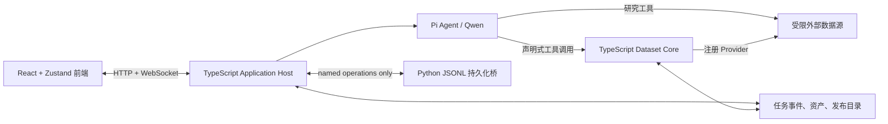
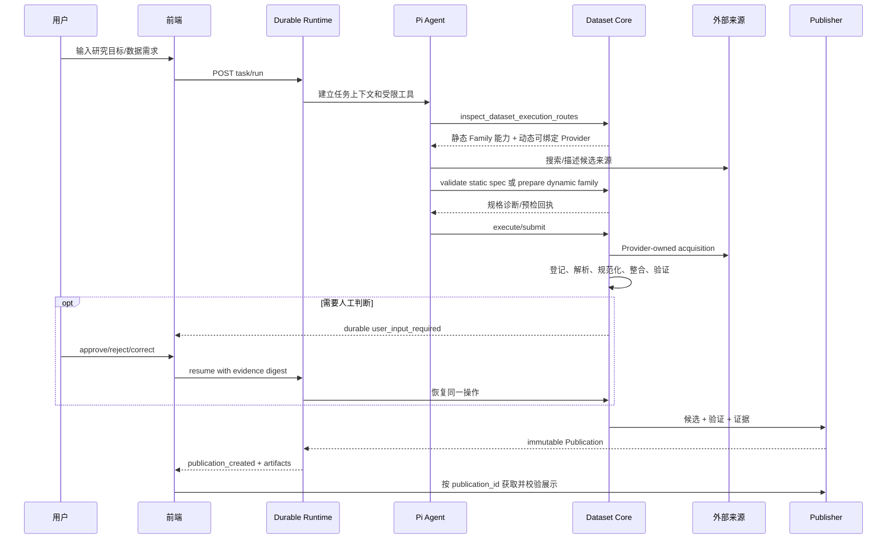

# BioMed-QAgent 架构与赛题解法

> 静态逆向基线：2026-08-27  
> 事实来源：当前仓库代码与 `PROBLEM.md`。本文不依赖已删除文档，也不把测试名称、历史注释或旧迁移方案当成现行架构事实。  
> 评估边界：本文说明代码表达的设计与调用关系；没有把外部数据源可用性、模型效果或真实大规模运行结果当成已经验证的结论。

## 1. 一句话结论

BioMed-QAgent 不是让大模型直接生成一份 CSV，而是把大模型限制在“理解科研需求、查找来源、选择已注册能力和提交声明式规格”的位置，再由 TypeScript Dataset Core 完成来源资产登记、确定性解析、字段规范化、合并、质量门禁、人在回路和不可变发布。

面向赛题“从科学问题到可用数据”，系统形成了三层结果：

1. **研究与暂存结果**：Agent 搜索网页、数据库、论文、附件、PDF 和图表后得到的工作文件，仅用于探索或作为后续正式输入。
2. **Dataset Core 候选结果**：输入已绑定到任务拥有的来源资产，经过固定执行骨架或注册式多表运行时，形成带 `OperationResult`、验证和证据的候选数据产品。
3. **正式 Publication**：通过发布门后生成的不可变目录、清单、校验摘要和字节摘要。只有这一层被产品界面视为正式完成。

这一设计最重要的价值，是把“LLM 说它做完了”和“系统能够证明产物是什么、从哪里来、经过什么处理”分离开。

## 2. 与赛题的对应关系

赛题主选题要求查找、解析、清洗、字段对齐、来源标注和结构化输出，项目分别用下列机制承担：

| 赛题要求 | 项目机制 | 可信边界 |
| --- | --- | --- |
| 数据查找 | Pi Agent、数据库专用工具、声明式数据库工具、浏览器、PubMed/GEO/GDC 等来源客户端 | Agent 负责查询策略；工具负责受限网络访问和返回真实响应 |
| 数据采集 | Core acquisition provider、统一下载器、内容缓存、断点续传、重试和大小限制 | Provider 决定 URL、方法、请求头和预期媒体类型，Agent 不能注入代码或路径 |
| 数据解析 | 注册 Adapter、GEO/表达矩阵解析器、XML/JSON/XLSX/PDF 解析器、Qwen-VL 图表提取 | 正式静态路线只接受已注册 Adapter；PDF/VLM 输出默认先是暂存结果 |
| 数据清洗 | 类型检查、缺失值门禁、命名空间授权、单位/尺度/语义检查、无效行隔离 | 确定性代码执行，异常行进入 audit，而不是静默修补 |
| 字段对齐 | Schema、FieldMapping、NormalizationProfile、probe-to-gene 映射、HIL 字段修正 | 模糊映射不能自动升级为已确认映射 |
| 多源整合 | 固定 merge strategy、多表 Family Assembly、主外键/基数验证 | Agent 不能提交任意 merge 步骤 |
| 来源标注 | SourceAsset、注册回执、Provider revision evidence、SourceLocator、provenance 文档 | 内容摘要与任务身份绑定；发布前再次校验 |
| CSV 输出 | 单表或多表 CSV、schema/provenance/audit/validation 清单 | 正式下载只从不可变 Publication 提供 |
| 错误修正 | Durable HIL、结构化 `correct` 决策、checkpoint 重放 | 决策绑定证据摘要和 request/run/requirement 身份 |
| 图表数据 | PDF 嵌入图像提取、Qwen-VL、PDF 表格与 caption 降级链 | 有提取能力，但正式发布接线仍有缺口，见第 15 节 |

## 3. 进程拓扑

当前正式拓扑只有一个 TypeScript Application Host；不存在并行的 FastAPI 主后端。



启动入口是 [`server/src/index.ts`](../server/src/index.ts)：

- `pnpm dev` 启动 Server 包，由 Server 内嵌 Vite middleware 提供前端。
- 生产 `pnpm start` 先构建 Server，再由同一 Host 提供静态前端。
- Host 先绑定端口，再初始化数据库桥、浏览器池、模型配置和正式运行时；初始化期间 API 返回 503。
- `SIGINT`/`SIGHUP` 走生命周期关闭；开发 watch 的 `SIGTERM` 直接退出，遗留活跃 run 在下次启动时由 durable repository 标记为 interrupted。

装配中心是 [`server/src/bootstrap.ts`](../server/src/bootstrap.ts) 和 [`server/src/runtime/phase3-composition.ts`](../server/src/runtime/phase3-composition.ts)。每个任务会得到独立的 Workspace、Dataset Core、SourceAssetRegistry、权限 Broker、HIL Gate、采集运行时和工具集合。

## 4. 仓库分层与所有权

| 目录 | 职责 | 不应承担的职责 |
| --- | --- | --- |
| `packages/contracts` | 前后端共享 wire DTO、严格解析器和枚举 | 业务 I/O、网络和文件操作 |
| `server/src/agent` | 模型适配、工具注册、权限、工作区和事件适配 | 决定正式数据是否可发布 |
| `server/src/external` | HTTP、DNS/URL 策略、浏览器池、来源客户端、统一下载 | 字段语义与数据族发布 |
| `server/src/processing` | PDF、表格、图表/VLM 等研究型处理 | 自动获得正式发布权 |
| `server/src/dataset` | 规格、采集、Adapter、规范化、整合、验证、动态 Family、发布 | UI 状态管理 |
| `server/src/runtime` | Durable task/run、HIL、事件、SourceAsset 登记和恢复 | 来源领域解析 |
| `server/src/product` | 正式 Publication、缓存和数据库产品 API | 执行 Agent 推理 |
| `server/src/persistence` | 原子 JSON、Python bridge 客户端、缓存登记 | 任意 SQL 或业务解析 |
| `database` | 标准库 Python 的缓存/声明式数据库持久化 | Agent、Dataset Core、任意 SQL 执行 |
| `frontend` | 任务交互、事件投影、HIL、Publication 查看与下载 | 重做后端验证或信任浏览器状态 |

这套分层中最关键的是两个物理隔离的任务目录：

```text
data/
├── workspaces/<taskId>/              # Agent 可工作的文件系统
├── output/tasks/<taskId>/            # BioMed 运行时和 Dataset Core 拥有
│   ├── events.jsonl
│   ├── state/task.json
│   ├── state/hil/requests/
│   ├── state/source-asset-registrations.json
│   ├── state/core-acquisition-provenance.json
│   ├── source_assets/
│   └── dataset_runs/<runId>/<requirementId>/
│       ├── state/
│       ├── canonical/ 或 tables/
│       ├── merged/
│       ├── dataset_manifest.json
│       ├── validation_report.json
│       └── publish/<publicationId>/
├── cache/
│   ├── records/<namespace>/<datasetId>/main_data.csv
│   ├── records/<namespace>/<datasetId>/manifest.json
│   └── index.sqlite3                 # 只作搜索索引
└── skills/                           # 用户声明式数据库 manifest
```

Workspace 文件是 Agent 暂存物，不因存在就成为可信产物；`output/tasks` 中的正式资产也不能由 Workspace 写工具任意修改。

## 5. 核心领域对象

### 5.1 DatasetExecutionSpec

[`packages/contracts/src/dataset-execution.ts`](../packages/contracts/src/dataset-execution.ts) 定义静态注册路线的冻结规格，核心字段包括：

- `requirement_id`：一次语义数据需求的稳定身份；
- `objective`：研究目标；
- `dataset_family`、`row_granularity`、`schema_ref`：结果的语义产品、行粒度和 schema；
- `entities`、`cohort_filters`、`required_fields`：实体、队列和字段要求；
- `source_bindings`：每个来源的 source、provider/recipe、adapter、accession 和参数；
- `normalization_profile_ref`、`merge_strategy`、`validation_profile_ref`：服务端注册策略；
- `output_format`：当前注册 Family 均以 CSV 为正式输出。

它不是 Agent 自定义工作流。Agent 只能在当前 Family Registry 的组合内选择，`SpecValidator` 会交叉校验 Family、Schema、来源、Adapter、参数、粒度、目标实体层级和 validation profile。

### 5.2 SourceAsset 与注册回执

来源文件进入正式链前会被流式计算 SHA-256，并登记为 `asset_<sha256>`。注册回执绑定：

- `task_id` 与 asset role；
- 相对路径、媒体类型、字节数和 SHA-256；
- 来源 ID；
- Core acquisition 的 provider ID、实现摘要和请求身份摘要；
- 对支持权威版本身份的 Provider，还绑定 canonical accession、snapshot identity 和 revision token。

SourceAssetRegistry 只接受 `source_assets/` 下的普通文件，拒绝目录逃逸、符号链接和任务间复用。旧式相对路径仍可在静态执行入口被登记，但会记录 compatibility telemetry；动态路线只接受任务拥有的 Core asset ID。

### 5.3 OperationResult 与 checkpoint

每个执行操作有输入摘要、参数摘要、实现版本、输出摘要、输出文件清单和状态。成功输出只有在文件摘要与结果清单闭合时才能复用。

Executor 将 attempt 追加保存，并为操作输出写 checkpoint。重启时：

- 已完成且摘要一致的操作可以跳过；
- 缺失、损坏或身份不匹配的 checkpoint 失效并重跑；
- parse 的完整 `DataBatch` 另外持久化，避免恢复时用不完整统计“猜回”解析状态；
- publish 前再次检查锁 fence，防止超时或失去租约的旧执行晚到发布。

### 5.4 PublicationCandidate、Manifest 与 Publication

`PublicationCandidate` 描述待发布表、关系、provenance refs 和 confidence refs。Manifest 是正式数据产品索引：

- 单表清单使用现有 V1 消费形状；
- 多表清单使用 V2，额外记录 tables、relations 和 ProductAssessment；
- artifact role 统一为 `primary_dataset`、`supporting_dataset`、`schema`、`provenance`、`audit_report`；
- 每个 artifact 记录相对路径、媒体类型、大小与 SHA-256。

`DatasetPublication` 是不可变发布回执，记录 `publication_id`、manifest 路径、manifest 文件字节摘要、validation result 和 supersedes 关系。

### 5.5 ProductAssessment

多表产品不只检查“文件存在”，还可按 schema、relations、identifiers、provenance、confidence 和 reproducibility 六个维度评估。

- 无 blocker：`publishable`；
- 只有可复现性 blocker：`validated`；
- 有语义 blocker：`incomplete`。

发布路径要求产品达到相应门槛；例如生物活性跨库 compound identity 冲突不会被强行合并，而会保留冲突并阻止其被称为 publishable。

## 6. 从用户问题到正式数据集的控制流



Agent 的系统提示强制数据生产请求先调用 `inspect_dataset_execution_routes`，一次只选择一条正式路线：

- Family、Schema、Source、Adapter 和拓扑精确匹配时走静态路线；
- 静态拓扑不能表达需求，但每个输入都能由 Core Provider 获取或已有 Core asset 时，走动态 Family；
- 两条正式路线确实无法闭合时，才允许交付明确标注为 provisional 的工作区 CSV，并同时报告缺失来源和阻塞原因。

## 7. 数据查找与来源发现

数据查找层是“Agent 规划 + 专用工具执行”，不是一个全局搜索 API。

### 7.1 已有发现通道

- 文献：PubMed 搜索、Europe PMC 全文/补充材料、论文题目理解；
- 表达组学：GEO 搜索/描述/补充文件、GDC 项目与文件、UCSC Xena；
- 变异与疾病：dbSNP、ClinVar、GWAS Catalog；
- 药物与生物活性：ChEMBL、PubChem、openFDA；
- 蛋白与通路：UniProt、PDB、Reactome；
- 微生物组：MGnify、GMRepo；
- 其他权威来源：ClinicalTrials.gov、Orphanet、HGNC、ClinGen、NCBI Taxonomy；
- 通用网页：受限 Playwright crawler、页面下载与截图；
- 本地来源：用户上传、全局数据缓存、用户声明式 HTTP 数据库。

### 7.2 查找和正式采集的区别

专用 research tool 的一次成功响应只证明该调用返回了若干记录，不自动证明：

- 已覆盖问题子领域的全部数据库；
- 已覆盖一个来源内的全部分页结果；
- 数据已进入正式 SourceAsset Registry；
- 返回字段符合目标 Family Schema；
- 数据可以发布。

因此正式路线会重新通过 Core acquisition 获取或登记载体。Core Provider 控制真实 URL、HTTP 方法、Host allowlist、媒体类型、最大大小和实现摘要；Agent 参数禁止出现 code/command/path/filename/script 一类控制字段，也不能携带绝对路径或 `..`。

### 7.3 下载可靠性

统一采集运行时提供：

- 最多三次 attempt；
- 对网络错误、超时、下载不完整等可重试失败继续；
- `.part` 文件与 Range 断点续传；
- expected size、SHA-256、MD5 和媒体类型检查；
- DNS/URL policy 与允许 Host；
- attempt、cache lineage、resume 来源和最终 asset 回执持久化；
- 成功后登记到任务 SourceAsset，并可登记到全局缓存。

## 8. 数据解析

### 8.1 静态注册 Adapter

静态路线中，`source + adapter_id + schema_ref` 必须是 Family Registry 中的精确组合。Adapter 将来源载体解析成 `DataBatch` 或注册式表结果，同时产生：

- 行数、列数和 parser 版本；
- 字段映射候选；
- 原始字段/行定位；
- 来源与提取通道统计；
- 警告和 audit；
- 解析后文件及摘要。

GEO 表达路线还区分 series matrix、supplementary matrix、样本元数据和 GPL annotation。若目标是 gene-level 但来源是 probe-level，必须显式提供 annotation/mapping asset；系统不会靠探针字符串形状猜成基因。

### 8.2 PDF 表格

[`server/src/processing/pdf`](../server/src/processing/pdf) 的流程是：

1. 用 `pdfjs-dist` 打开 PDF，读取每页带坐标的文本、描边线段和嵌入 raster image；
2. 对有框线表格，聚类横纵线并按网格单元放置文本；
3. 对无框线表格，按 y 坐标聚类行，再按 x 顺序恢复列；
4. 仅当 pdfjs 无法打开时，回退到原始流正则文本提取，并返回精度警告；
5. 没有文本层但包含图像时，不返回空成功，而是明确提示使用 VLM。

输出表写入任务 `parsed/` 区域，包含页码、行列数和保存路径。

### 8.3 图表与 VLM

`extract_chart_data_vlm` 是三级降级链：

1. Qwen-VL 从 PNG/JPG/WEBP/GIF 或 PDF 嵌入图像提取 chart type、坐标轴、数据点和图例；
2. VLM 失败时尝试 PDF table；
3. 再失败时尝试 caption text；
4. 全部失败才返回 error，不把空表当成功。

结果以 `chart_data.csv` 和 `chart_data_points.csv` 写入 `parsed/chart_data/`。调用外部 VLM 需要凭据权限 Gate；VLM/LLM/OCR/web extraction 属于非确定性通道，置信度不能自动达到 high，并要求相应人工复核策略。

## 9. 清洗、字段对齐和规范化

以表达数据专用运行时为例，清洗不是一个模糊的“LLM 清洗”步骤，而是可审计的固定操作：

1. **Schema 选择**：先确定 gene-level 或 probe-level 行粒度和目标字段。
2. **字段映射**：Adapter 产生 `FieldMapping`，保存 source field、target field、transform、方法、证据、置信度和 review status。
3. **模糊映射门禁**：string similarity 或 proposed mapping 必须进入 blocking HIL；用户只能按结构化 correction 修改目标字段/transform。
4. **标识符规范化**：只接受声明的命名空间和注册规则；例如 Ensembl version 被拆分保留，GEO probe 不会被猜成 gene symbol。
5. **探针映射**：GPL annotation 构建 probe index，映射结果、覆盖率和残留 probe 写入独立 audit。
6. **单位处理**：已注册线性换算规则可自动应用；未知单位必须由人给出 from/to/factor/offset/evidence，不能由模型自行换算。
7. **语义与尺度检查**：value semantics、value scale、unit 必须在 NormalizationProfile 白名单内；`unknown` 保持未知，不提升为已知。
8. **数值检查**：空值或非有限数进入 rejected CSV。
9. **无效行隔离**：拒绝行记录 reason code、来源文件、原始行号和原值；不会从主表静默消失。
10. **规范化日志**：canonical CSV、rejected CSV、normalization log 和 field mappings 一起成为 audit artifact。

大文件按流处理，Writer 分块刷新；每处理一定数量的行主动 checkpoint/yield，使取消与超时能够生效。

## 10. 多源整合

### 10.1 表达数据

服务端只实现注册的 `append_by_canonical_row` 语义。行身份由 Schema 的 integration contract 决定；现有表达语义核心是实体、样本、测量类型和值语义的组合。

- 相同身份且数值相等：视为镜像重复，保留一条并增加 `dedup_count`；
- 相同身份但值冲突：按确定性来源顺序保留第一条，将双方来源和值写入 `conflicts.csv`，增加 `conflict_count`；
- 不允许 Agent 注入自定义 merge code；
- 去重索引使用任务内临时磁盘结构并受资源配额约束，避免全量驻留 JS heap；
- revision-scoped schema 要求每行 dataset/revision identity 与 Core 从来源回执推导的身份一致。

这里的“first source wins”是确定性冲突保留策略，不表示第一个值被证明更正确；冲突 audit 必须随发布暴露。

### 10.2 注册式多表 Family

多表路线先把每个注册载体解析为表级 `OperationResult`，再由 Family Assembler 生成表清单与关系。B3 多表验证会检查：

- 必需/可选/允许空表的闭包；
- header 与 schema；
- 主键唯一性；
- 外键完整性；
- one-to-one、one-to-many、many-to-one、many-to-many 基数；
- relation missing policy；
- token preservation；
- provenance/confidence 引用；
- 内存或磁盘索引资源决策。

## 11. 当前静态数据族

默认 Family Registry 注册 6 个正式数据族：

| Family | 运行时 | 主要正式来源/表拓扑 |
| --- | --- | --- |
| `gene_expression` | 专用表达运行时 | GEO、GDC、UCSC Xena；gene/probe long table |
| `literature_evidence` | 注册式多表 | `literature_evidence` 主表 + `papers` + `sources`；PubMed BioC XML 或注册 JSON 表 |
| `target_evidence` | 注册式多表 | `targets` 主表 + `evidence` + `sources` + 可空 `supporting`；UniProt、ClinVar、ClinicalTrials carrier |
| `variant_evidence` | 注册式多表 | `variant_assertions` 主表 + `evidence` + `sources`，并有受信任 derived mapping 能力 |
| `protein_structure` | 注册式多表 | `structures` 主表 + `chains` + `ligands` + `sources`；PDB carrier |
| `bioactivity_measurement` | 注册式多表 | `activities` 主表 + compounds/assays/targets，ChEMBL；可选 PubChem crosswalk |

“采集目录存在某 Provider”不等于“静态 Family 已支持它”。例如 GWAS Catalog、MGnify、OpenFDA、GMRepo、Orphanet、HGNC、ClinGen 和 NCBI Taxonomy 可以被 Core 正式采集，但若没有精确静态拓扑，应走动态 Family，而不是伪装成已有 Family。

## 12. 固定执行骨架

表达路线的执行计划由 [`server/src/dataset/runtime/plan.ts`](../server/src/dataset/runtime/plan.ts) 固定生成：

```text
每个 binding 并行扇出：
  acquire -> parse -> canonicalize

全部 binding 汇合：
  compatibility_gate
    -> integrate
    -> [derive，仅在服务端提供可信 handler 时存在]
    -> assemble
    -> validate_profile
    -> publish
```

关键控制语义：

- Agent 不能添加、删除或重排 operation；
- Phase A 的单个来源可以被记录为 rejected，但所有来源都失败时整体失败；
- 每个 operation 有 timeout、AbortSignal、attempt 和摘要；
- HIL 等待期间 operation timeout 暂停，恢复后继续计算；
- 同一 task + requirement 有 execution lock；
- publish 在最终 rename 前检查 cancellation、generation 和 lock fence；
- 已发布目录不可变，新版本通过 `supersedes_publication_id` 关联旧版本。

注册式多表运行时没有逐节点复用同一通用 Executor，但其代码仍固定执行 parse、integrate、assemble、B3 validation 和 publish，Agent 同样不能自定义步骤。

## 13. 动态数据族路线

动态路线用于“Core 能正式取得输入，但默认 Registry 没有目标表拓扑”的情况。

### 13.1 声明内容

Agent 必须一次提交完整且闭合的：

- `FamilySpec`：表定义、角色、主键、关系、身份规则、validation/assessment policy；
- `Projection`：本次选中的 primary/supporting/derived tables、必需/可空集合和行粒度；
- `DatasetExecutionProposal 2.0`：来源 binding、transform ref 和 idempotency identity；
- TypeScript transform source 与 metadata；
- 每个 binding 的 Core acquisition request 或既有 Core asset ID。

### 13.2 两阶段协议

1. `prepare_dynamic_family_publication` 是无副作用 preflight：验证 canonical digest、拓扑闭包、transform descriptor、资源策略和采集可计划性，返回 task/requirement/generation/submission-bound receipt。
2. `submit_dynamic_family_publication` 必须携带同一 receipt。Host 重新计算并核对全部摘要，取得 execution lock，按 preflight 计划采集输入，并拒绝 generation 或请求身份漂移。

### 13.3 Transform 和 Core admission

当前 transform 是同步 TypeScript，输入是冻结的 Core asset 文本，输出必须是闭合的 CSV envelope。Host 对源码做严格准入，禁止 import、process、require、globalThis、eval、文件系统、网络、动态 property 等能力，并限制 wall time、CPU、内存、输入/输出和日志。

输出不会因 transform 返回成功就直接发布。Core 会重新检查：

- task/run/requirement/invocation/attempt/generation；
- deadline 和 cancel fence；
- output table/schema/handle/locator 闭包；
- UTF-8、CSV header、行宽和 row count；
- 文件大小和 SHA-256；
- quarantine 目录无多余文件、无 symlink/junction/hardlink；
- 复制前后与原子 rename 后重复 re-hash；
- OperationResult、provenance/confidence 和 ProductAssessment。

### 13.4 必须披露的安全边界

当前真实执行后端是 `in_process_unisolated`，代码明确声明它**不是 sandbox、隔离机制或 security boundary**。源码 denylist、冻结对象和资源限制是风险降低措施，不能替代 OS/container 隔离。

因此动态路线只适合受控环境中的可信操作者/模型输出。若作为公开多租户 API，对任意不可信 transform 开放会是高优先级风险。仓库已经定义 future sandbox proof gate 和 release gate，但当前 Host 构建不会把它们解释为已有生产隔离。

## 14. 验证、置信度和人在回路

### 14.1 Validation Profile

表达发布门检查：

- 主数据存在且至少一行；
- UTF-8；
- header/列数/每行宽度符合 Schema；
- required field 非空；
- 数值列可解析且有限；
- 单位一致；
- 每行来源文件和 asset provenance 闭合；
- gene-level 的 probe-to-gene 覆盖达到服务端阈值；
- confidence artifact 存在且满足最低 medium、无未审低置信主记录。

统计异常检测会识别全空、常量、极端值、异常符号和可疑等差序列等现象，当前主要作为 warning/audit，不会擅自修改值。

### 14.2 Confidence

置信度由 source reliability、extraction reliability、mapping reliability、cross-source consistency 和 human review state 组合，取适用维度中的保守下界：

- 来源冲突直接降为 low；
- 部分一致最高 medium；
- VLM/LLM/OCR/web extraction 即使其他分量为 high，最终也最多 medium；
- human rejected 变为 low；
- proposed string mapping 标记 pending human review。

系统保存 batch default 与 record override 两层置信度，并在 Manifest 中给出等级、审核状态和原因分布。

### 14.3 Durable HIL

HIL 覆盖字段映射、单位换算、浏览器证据接受和 publication acceptance。请求包含 evidence、policy、idempotency key 和 evidence digest；决策支持 approve/reject/skip/correct，`correct` 必须携带结构化 correction。

请求与决策写入 Durable store 和任务事件流。Host 重启后会恢复未完成请求；决定已经存在时，操作按相同 checkpoint 重放，而不是让模型再次解释一段自然语言。

## 15. 图表数据的实际完成度

从静态调用关系看，需要区分三个层次：

1. **已接通**：PDF 内嵌图像提取、Qwen-VL 调用、PDF table/caption fallback、CSV 落盘、外部凭据权限、VLM HIL 与置信度规则。
2. **已实现但未接入默认正式路由**：`dataset/families/bioactivity-measurement/chart-evidence` 下已有 chart series/points/papers/sources Schema、Assembler、Validation 和注册 Adapter 模块。
3. **未发现生产接线**：默认 Family Registry、默认注册式多表执行和工具装配没有引用上述 chart-evidence 模块；`extract_chart_data_vlm` 结果仍写在处理暂存区，未看到将其自动提升为正式 SourceAsset + OperationResult + Publication 的端到端入口。

因此演示可以证明“系统能提取图表 CSV”，但当前代码不足以证明“VLM 图表结果已经进入默认正式 Publication 链”。这是赛题明确考察图表提取/校验时最需要补齐或在答辩中如实限定的部分。

## 16. 发布与消费

Publisher 的顺序是：

1. 检查 Validation passed、Manifest 与候选身份、来源资产闭包；
2. 创建临时 staged publication 目录；
3. 流式复制每个 artifact，同时按 Manifest 重算大小和 SHA-256；
4. 写入由已门禁字节生成的 `dataset_manifest.json`；
5. 写 `publication.json` 和 validation result；
6. 再次检查取消/锁 fence；
7. 原子 rename 为不可变版本目录；
8. 返回 `publication_id` 和 supersedes 关系。

Product API 枚举 Publication 时重新计算 manifest 文件摘要；下载 artifact 时再次检查路径不逃逸、文件大小和 SHA-256。也就是说，前端不是直接浏览任意任务文件，而是消费经过清单约束的正式内容。

前端 Publication Viewer 提供：

- 主数据 CSV 预览/下载；
- 来源数、逐行追踪率、字段映射数、去重/冲突统计；
- Validation status、检查/失败数；
- ProductAssessment；
- high/medium/low 和人工审核状态分布；
- audit、schema、provenance、warning；
- V2 多表拓扑和关系浏览。

## 17. Durable Runtime、API 与前端投影

### 17.1 事件事实源

每个任务的 `events.jsonl` 是 append-only 事实源，sequence 必须连续。`task-reducer` 从事件重建 Task、Run、Message、Artifact 和 Publication 快照。

主要事件包括 run queued/started/completed/failed/cancelled/interrupted、assistant/reasoning delta、tool started/progress/completed、operation 进度、HIL required/resumed、artifact produced 和 publication created。

### 17.2 API

正式 Host 暴露的主要资源：

- `POST/GET /api/v1/tasks`、`GET/DELETE /api/v1/tasks/:id`；
- task events、messages、artifacts、runs、cancel、resume、compact 和 context injection；
- `POST /api/v1/import/tasks`；
- run permission resolution；
- `GET /api/v1/publications`、publication detail 和 artifact download；
- databases、cache、settings/model registry、personalization 和 skill iteration；
- `WS /api/v1/ws` 用于增量事件与控制帧。

WebSocket 只接管固定 upgrade path；连接有 message size 和 buffered bytes 上限。前端启动时先用 HTTP hydrate durable snapshot，再订阅 WebSocket 增量，reducer 保持同一状态模型。

### 17.3 Python bridge

Python 不是业务后端。`DatabaseClient` 管理一个长生命周期 `database/bridge.py` 子进程，通过逐行 JSON 协议调用固定 named operations：

- `cache.commit/search/list/describe/get/delete/clear`；
- `database.list/get/save/patch/delete/set_enabled/tool_manifests`。

Bridge 拒绝任意 SQL，也不导入 Agent、Skill 或 Dataset Core。缓存权威数据是 CSV + manifest，SQLite 只作 FTS/列表索引；用户数据库 manifest 与 enabled state 使用临时文件 + `os.replace` 原子写入。

## 18. 权限与安全模型

系统有四个不同的信任边界，不应混为一谈：

1. **Agent Workspace 权限**：读写/搜索/执行命令经过路径策略、protected paths、临时 grant 和 append-only audit。
2. **外部网络权限**：公共 HTTP client 执行 URL/DNS 策略；浏览器池限制 context；VLM 凭据使用需要 permission gate。
3. **数据正式化权限**：只有 SourceAssetRegistry、Dataset Core、Validation 和 Publisher 可以把工作文件提升为正式数据产品。
4. **动态代码执行权限**：当前仅有进程内非隔离限制，不是完整安全边界。

浏览器下载尤其采用“两步信任”：下载先产生 browser evidence，记录 requested/final URL、redirect chain、媒体类型、字节数、摘要和 policy revision；只有匹配已 PROMOTED parser recipe 且用户接受完整证据后，Core 才登记正式 asset/provenance。接受的是固定解析管线，不是任意网页内容或任意代码。

## 19. 失败语义与恢复

系统坚持 fail closed：

- invalid spec 在读文件前拒绝；
- 非 retryable adapter/schema/topology 错误不能原样重试；
- 一个来源失败只证明该来源失败，不能把部分成功说成完整成功；
- 全部 binding 被拒绝返回 no-data/失败语义，不生成空成功 Publication；
- HIL 未完成时暂停，不能绕过为工作区结果；
- timeout/cancel 后即使旧 operation 晚到，也会被 cancel/lock/generation fence 阻止发布；
- checkpoint 文件缺失或摘要漂移时重跑；
- Publication 消费时发现摘要不符返回损坏错误，而不是继续展示。

## 20. 作为评审的静态评价

以下是基于代码架构的预评，不是替代真实测试案例和现场 API 验收的最终比赛评分。

### 20.1 建议预评分

| 初赛维度 | 建议分 | 评价 |
| --- | ---: | --- |
| 数据查找完备性 | 18/25 | 来源广、支持网页/数据库/附件/上传/缓存，但查找由 Agent 策略驱动，尚无可验证的“来源宇宙、分页覆盖率、查全率”证明 |
| 来源可追溯性 | 24/25 | SourceAsset、Provider revision、SourceLocator、OperationResult、Manifest 和消费时重验构成了很强的证据链 |
| 清洗整合可靠性 | 22/25 | 静态路线确定性强，字段/单位/HIL/去重/冲突/PK-FK 门禁细；动态路线当前非隔离，且不同 Family 的语义验证深度不完全一致 |
| 输出格式可用性 | 20/25 | 单/多表 CSV、schema、provenance、audit 和拓扑清晰；但当前前端 artifact URL 参数缺陷会影响下载，图表正式发布链也未闭合 |
| **合计** | **84/100** | 架构明显高于“Agent 生成 CSV”型方案，主要失分在可验证查全、图表正式化和产品收尾 |

### 20.2 最强竞争点

1. **正式完成定义严格**：工作区文件、工具返回、Validation 和 Publication 被明确分层，减少演示中“说完成但不可验证”的风险。
2. **来源证据链完整**：来源版本、文件摘要、逐行 provenance、字段 mapping、冲突 audit 和发布字节回执能直接回应赛题的可追溯性。
3. **LLM 与确定性 Core 分权合理**：LLM 做开放问题理解和来源选择，Core 做可复现的数据改变与发布判断。
4. **修正机制真实**：不是在 prompt 中口头“让人确认”，而是证据绑定、可持久化、可恢复的结构化 HIL。
5. **多表产品模型成熟**：Family/Projection/Table/Relation/ProductAssessment 比单一宽表更适合真实生物医学数据。

### 20.3 高优先级问题

#### A. 动态 Transform 没有操作系统隔离

这是部署安全风险，不是普通技术债。当前返回结果已经诚实标注 `security_boundary: false`，答辩材料也必须保持这个表述。上线公开多租户前，应以真正隔离的 worker/container 替换进程内执行，并让现有 sandbox proof gate 产生 Host 可验证而非 caller-reported 的证据。

#### B. 图表提取尚未闭合到正式 Publication

图表能力本身较完整，但默认注册表没有接入 chart-evidence Family 模块。建议最小化补齐一条受控正式路线：VLM 输出先生成带 bbox/model/prompt/transform/review 的 evidence asset，再由注册 Adapter、chart validation 和 ProductAssessment 发布。不要让任意 parsed CSV 直接获得发布权。

#### C. Publication Viewer 使用了错误的 artifact 路由参数

[`frontend/src/components/PublicationResultsViewer.tsx`](../frontend/src/components/PublicationResultsViewer.tsx) 在多个 `PublicationArtifactCard` 调用中传入 `detail.requirement_id`，而 API 路径要求 `publication_id`。Publisher 生成的是 `pub_<requirement>_<digest>`，两者通常不同，因此正式产物详情能加载，但 artifact 预览/下载可能 404。现有组件测试的 manifest 没有 artifact，未覆盖该行为。

#### D. 查找“完备性”缺乏可量化证明

当前提示词要求报告 requested/succeeded/failed counts，但没有统一的 QueryPlan/SourceCoverage artifact 来证明搜索了哪些数据库、每个数据库的查询式、分页终点、时间窗口、去重前后数量和未覆盖原因。赛题第一评分项是“问题子领域内是否完备”，仅靠工具数量和 Agent 叙述说服力不足。

### 20.4 中优先级问题

- 静态 Family 数量有限，动态提交协议非常完整但也非常复杂，模型一次生成全套 digest、拓扑和受限 transform 的成功率需要真实 eval 证明。
- 注册式多表有强 B3 结构验证，但各 Family 的领域语义完整性不同；不能把 PK/FK 通过等同于科学语义正确。
- `first source wins` 保证了确定性，不保证冲突值正确；前端应把 conflict audit 作为醒目质量信号。
- PDF 无框线表格的位置聚类是启发式，复杂跨页、合并单元格和旋转表格需要专门基准。
- 统计异常目前多为 warning，不自动阻止发布；答辩时应说明这是“提示人工判断”而不是自动纠错。

## 21. 面向答辩的推荐叙事

建议把产品描述为“可信科学数据编译器”，而不是“万能 AI Scientist”：

1. 用户给出研究目标，Agent 把自然语言编译为 Family、粒度、Schema 和来源 binding；
2. Search tools 找到候选载体，Core Provider 重取并登记真实输入；
3. 注册 Adapter 把异构来源编译成规范表；
4. 数据不确定性不会被模型抹平，而是进入 rejected/conflict/confidence/HIL；
5. Validation 与 ProductAssessment 判断数据产品是否闭合；
6. Publisher 输出可复用 CSV、Schema、Provenance、Audit 和不可变回执；
7. 用户反馈以结构化 correction 重新进入同一可重放流程。

代表性案例应至少覆盖：

- 一个 GEO probe-to-gene 表达整合案例，展示 annotation、coverage、rejected rows、dedup/conflict 和 HIL；
- 一个注册式多表案例，例如 ChEMBL + PubChem crosswalk，展示主外键和 identity conflict；
- 一个论文 PDF 表格案例，展示 page locator 和 fallback warning；
- 一个图表案例，但在正式链补齐前应明确标注为 processing preview，而不是 Publication；
- 一个错误修正案例，展示同一 request 的 evidence digest、用户 correction、checkpoint 恢复和新 Publication supersedes 旧版本。

## 22. 代码导航

| 主题 | 入口 |
| --- | --- |
| 赛题定义 | [`PROBLEM.md`](../PROBLEM.md) |
| Host 启动与装配 | [`server/src/index.ts`](../server/src/index.ts)、[`server/src/bootstrap.ts`](../server/src/bootstrap.ts) |
| 每任务正式运行时 | [`server/src/runtime/phase3-composition.ts`](../server/src/runtime/phase3-composition.ts) |
| Agent 系统约束 | [`server/src/agent/phase1-prompt.ts`](../server/src/agent/phase1-prompt.ts) |
| 共享执行契约 | [`packages/contracts/src/dataset-execution.ts`](../packages/contracts/src/dataset-execution.ts) |
| 静态路线工具 | [`server/src/agent/tools/dataset-execution.ts`](../server/src/agent/tools/dataset-execution.ts) |
| Family Registry | [`server/src/dataset/families/registry.ts`](../server/src/dataset/families/registry.ts) |
| Core service boundary | [`server/src/dataset/service/dataset-core.ts`](../server/src/dataset/service/dataset-core.ts) |
| Core 实现 | [`server/src/dataset/service/ts-core.ts`](../server/src/dataset/service/ts-core.ts) |
| 固定操作计划 | [`server/src/dataset/runtime/plan.ts`](../server/src/dataset/runtime/plan.ts) |
| Adapter | [`server/src/dataset/adapters`](../server/src/dataset/adapters) |
| Canonicalizer | [`server/src/dataset/canonicalizer/canonicalizer.ts`](../server/src/dataset/canonicalizer/canonicalizer.ts) |
| Integrator | [`server/src/dataset/integrator/integrator.ts`](../server/src/dataset/integrator/integrator.ts) |
| Validation | [`server/src/dataset/validation`](../server/src/dataset/validation) |
| Dynamic Family | [`server/src/dataset/dynamic-family`](../server/src/dataset/dynamic-family) |
| Transform Host | [`server/src/dataset/transform-host`](../server/src/dataset/transform-host) |
| Publisher | [`server/src/dataset/publish/publisher.ts`](../server/src/dataset/publish/publisher.ts) |
| Publication 产品 API | [`server/src/product/publication-store.ts`](../server/src/product/publication-store.ts) |
| Durable Runtime | [`server/src/runtime/durable-agent-runtime.ts`](../server/src/runtime/durable-agent-runtime.ts) |
| HIL | [`server/src/runtime/hil-store.ts`](../server/src/runtime/hil-store.ts)、[`server/src/dataset/review/hil-policy.ts`](../server/src/dataset/review/hil-policy.ts) |
| PDF/VLM | [`server/src/processing/pdf`](../server/src/processing/pdf)、[`server/src/processing/vlm`](../server/src/processing/vlm) |
| 前端事件投影 | [`frontend/src/runtime`](../frontend/src/runtime) |
| Publication Viewer | [`frontend/src/components/PublicationResultsViewer.tsx`](../frontend/src/components/PublicationResultsViewer.tsx) |
| Python named-op bridge | [`server/src/persistence/db-client.ts`](../server/src/persistence/db-client.ts)、[`database/bridge.py`](../database/bridge.py) |

## 23. 最终判断

当前架构的主干是合理且有必要的：Agent/Core 分权、固定规格、内容寻址、逐阶段 checkpoint、证据绑定 HIL 和原子发布都直接服务于赛题的“可靠、可追溯、可修正”，不是为了抽象而抽象。

需要谨慎的不是再增加一层框架，而是补齐三项可验收闭环：图表 evidence 到 Publication、查询覆盖率 artifact、前端正式 artifact 下载。与此同时，动态 transform 的隔离必须作为部署前置条件，而不应通过文案弱化。完成这些后，项目最有竞争力的卖点会从“数据源和工具很多”提升为“每一条正式科学数据都能解释来源、处理、质量和修正历史”。
