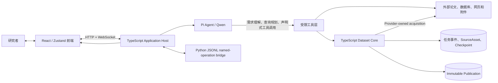
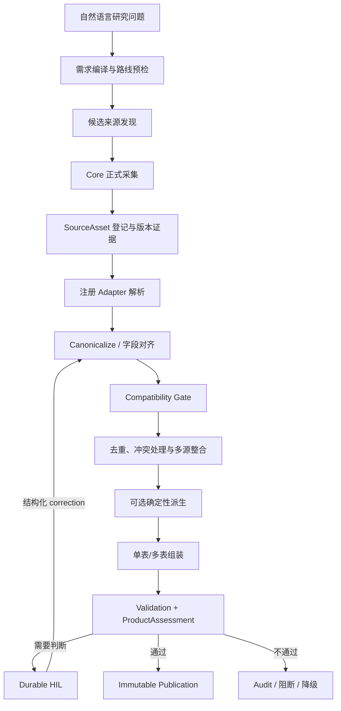

# BioMed-QAgent：面向可追溯生物医学科学数据整合的智能体系统

> 项目汇报 / 技术论文 Markdown 草稿  
> 赛题：XH-202619，赛道二“数据场景”，方向 1A“科学数据查找、解析与整合”  
> 版本日期：2026-08-27  
> 作者：[待补充]  
> 单位：[待补充]  
> 通讯作者及联系方式：[待补充]

> **证据边界说明。** 本文依据当前仓库代码、[`PROBLEM.md`](../PROBLEM.md) 和静态逆向形成的 [`ARCHITECTURE.md`](ARCHITECTURE.md) 撰写。凡标记为 `[待补充]`、`[待验证]`、`[图 X 占位]` 或 `[表 X 占位]` 的内容，均不能在正式提交时作为已经完成的实验或产品事实。当前工作副本未包含团队所述的真实 Gold 案例，因此本文不虚构准确率、召回率、节省比例或案例结论。

---

## 写作大纲

1. **摘要与研究背景**：说明真实科研中数据查找、解析和多源整合的具体障碍，以及本作品所解决的问题。
2. **相关工作与差异定位**：回顾科学数据检索、文档与图表解析、多源整合、数据溯源和 LLM Agent，并与通用检索、人工复制整理、一次性问答比较。
3. **问题定义与设计目标**：把“从科研问题到可用数据”形式化为有来源、有结构、有质量记录、可恢复和可修正的数据产品构建任务。
4. **系统设计**：介绍单一 TypeScript Application Host、Qwen/Pi Agent、Dataset Core、Durable Runtime、前端与持久化边界。
5. **数据处理方法**：详细说明需求编译、来源发现、正式采集、解析、规范化、字段对齐、去重、冲突处理、验证、人在回路与不可变发布。
6. **Qwen 与上下文工程**：解释模型承担什么、不承担什么，以及完成契约、路由预检、工具 Schema、Skill、证据上下文和恢复上下文如何降低幻觉风险。
7. **实验与案例**：预留 Gold 案例、基线、指标、消融、失败案例和用户成本实验模板。
8. **结果、成本与评审**：在已有代码事实范围内评价作品，明确可节省和新增的成本，并给出静态预评分。
9. **局限、未来工作与结论**：披露仍需人工核对、尚未支持和尚未闭环的能力，说明结果对真实科研数据适用性的意义。

---

## 摘要

真实科研中的数据需求通常以自然语言问题开始，却分散在论文正文、补充材料、开放数据库、网页表格、下载附件和图像图表中。研究者不仅要找到数据，还要判断版本与样本范围，解析异构格式，统一字段、实体标识、单位和粒度，处理重复、缺失与冲突，并保留足以复核的来源。通用搜索或大语言模型问答能够缩短“找到线索”的时间，但难以稳定产出可复现、可追溯且可继续分析的数据产品。

本文提出 BioMed-QAgent，一个面向生物医学科学数据查找、解析与整合的智能体系统。系统采用“开放式推理与确定性数据处理分权”的设计：Qwen 驱动的 Pi Agent 负责理解研究目标、发现候选来源、检查可用执行路线并提交声明式数据需求；TypeScript Dataset Core 负责来源资产登记、已注册解析器执行、规范化、多源整合、质量门禁、人在回路和正式发布。系统不将 Agent 工作区中的临时 CSV 视为任务完成，而以包含数据表、Schema、Provenance、Audit、Validation 和内容摘要的不可变 Publication 作为正式结果。

当前实现支持 `gene_expression`、`literature_evidence`、`target_evidence`、`variant_evidence`、`protein_structure` 和 `bioactivity_measurement` 六类静态数据产品，并提供动态 Family 协议处理静态注册表无法表达的多表拓扑。来源文件通过 SourceAsset、SHA-256、Provider revision evidence 和 SourceLocator 进入证据链；不确定的字段映射、未知单位和低置信度抽取可以触发可持久化的人在回路请求；任务中断后可依据事件、操作摘要和 checkpoint 恢复，而不要求模型重新解释已经确认的数据变换。

本文进一步给出面向赛题四项指标的评估方案与 Gold 案例模板。基于静态代码审查，项目在来源可追溯性、清洗整合可靠性和可修正闭环上具有较强设计；当前主要不足是检索完备性尚缺统一覆盖率证据、图表提取尚未接入默认正式发布主链，以及动态 Transform 尚不具备操作系统级安全隔离。正式产物前端已按 `publication_id` 生成 artifact URL，并加入标识分离的回归测试。真实案例效果与成本收益仍需在团队 Gold 数据上补充定量实验。

**关键词：** 科学数据整合；生物医学数据；大语言模型智能体；Qwen；数据溯源；人在回路；多源异构数据；可复现数据产品

---

## 1 引言

### 1.1 真实科研中数据查找与整合的具体不足

在生物医学研究中，“找到数据”并不是搜索到一个网页链接。一个可用于下游分析的数据集至少需要同时回答：数据对应什么实体和样本、来自哪个版本、如何从原文件变成当前字段、不同来源能否在同一粒度上合并、哪些值存在冲突，以及哪些判断仍需研究者确认。现有工作流程主要存在以下不足。

第一，**数据来源分散且检索接口异构**。同一研究问题可能同时涉及 PubMed 或 Europe PMC 中的论文、GEO/GDC/Xena 中的表达数据、ClinVar/GWAS Catalog 中的变异证据、PDB/UniProt 中的蛋白信息，以及论文附件或网页下载。不同平台的查询语言、分页方式、访问限制、版本标识和返回格式不同。研究者往往能找到“相关页面”，但难以证明是否覆盖了应查来源、是否遍历了分页、是否遗漏补充材料。

第二，**可读信息不等于可计算数据**。论文中的 HTML、XML、PDF 表格、扫描图、折线图和补充 XLSX 需要不同解析方法。复杂表格还可能包含合并单元格、跨页表头、脚注、单位信息和缩写。视觉模型可以读取图表，但模型输出本身具有非确定性，若不保留页码、边界框、模型身份、提示版本和置信度，就难以复核。

第三，**多源数据的语义不自动一致**。相同列名可能代表不同测量语义，不同列名也可能代表同一概念；基因、探针、变异、化合物和样本各自有不同标识体系。以表达数据为例，probe-level 与 gene-level 具有不同的行粒度，原始强度、归一化表达量和对数值不能仅凭列名直接拼接。以生物活性数据为例，同一化合物的跨库 identity、实验类型和活性单位需要显式 crosswalk 与冲突记录。

第四，**人工复制整理难以复现**。常见流程是在浏览器、Excel、脚本和聊天窗口间复制内容。即使最终得到 CSV，也常缺少原始文件摘要、检索条件、字段映射、被拒绝行、冲突处理和处理程序版本。后续发现错误时，研究者难以判断应修改哪一步，只能重新整理。

第五，**一次性问答无法承担长流程状态**。科学数据任务可能因下载、权限、人工确认或服务故障跨越多个会话。普通问答把中间状态留在上下文窗口中，一旦超时或重启，模型容易重复下载、改变处理口径或忘记用户已确认的修正。

### 1.2 本作品希望解决的问题

BioMed-QAgent 面向的不是“替研究者得出科学结论”，而是赛题明确提出的上游问题：**将自然语言研究目标转换为一份可以继续分析、可以追溯来源、可以检查质量并可以在反馈后修正的结构化科学数据产品。**

系统试图解决四个连续问题：

1. 根据研究目标定位合适的论文、数据库、附件、表格或图像数据；
2. 把异构载体解析为明确 Schema 和行粒度下的规范记录；
3. 在不掩盖缺失、重复、单位差异和身份冲突的前提下完成多源整合；
4. 将每一步的来源、输入摘要、处理版本、质量判断和人工修正一起发布，使结果能被验证和复用。

系统有意不把科研分析和结论生成纳入正式完成标准。这样既符合赛题 1A 的任务边界，也避免将“数据是否正确”与“模型解释是否听起来合理”混在一起。

### 1.3 研究问题与数据需求

本文将用户输入抽象为研究目标 \(Q\)，并将可交付数据需求表示为：

\[
R = \langle F, G, S, E, C, A, N, M, V, O \rangle
\]

其中，\(F\) 为数据产品 Family，\(G\) 为行粒度，\(S\) 为目标 Schema，\(E\) 为实体集合，\(C\) 为队列或筛选条件，\(A\) 为来源与采集绑定，\(N\) 为规范化配置，\(M\) 为合并策略，\(V\) 为验证配置，\(O\) 为输出格式。该表示对应代码中的 `DatasetExecutionSpec`，其目的不是形式化用户的全部科学意图，而是把能够影响数据产品含义的关键选择固定下来。

对于一个合格结果 \(D\)，系统要求它不仅包含数据记录，还包含：

\[
D = \langle T, Schema, Provenance, Audit, Validation, Manifest \rangle
\]

其中 \(T\) 可为单表或具有主外键关系的多表集合。`Provenance` 描述来源和记录定位，`Audit` 保留丢弃、冲突和修正，`Validation` 描述质量门结果，`Manifest` 列举正式文件及其 SHA-256。只有当候选结果满足发布门时，系统才生成不可变 Publication。

### 1.4 主要贡献与创新点

本文将实际完成的功能归纳为三个贡献。

**创新点一：以“Agent 规划、Core 裁决”替代模型直接生成数据。** Qwen/Pi Agent 负责研究需求理解、来源探索和声明式工具选择，Dataset Core 独占正式数据变换与发布权。Agent 不能提交任意执行步骤，也不能仅凭工作区文件宣告任务完成。这一分权把模型适合处理的开放语义问题与代码适合处理的确定性质量问题分开。

**创新点二：构建从来源字节到正式 Publication 的可验证证据链。** 系统以 SourceAsset、SHA-256、Provider 请求身份、版本证据、SourceLocator、OperationResult、Validation Report 和 Manifest 串联数据生命周期。正式完成不是一个聊天答案或临时 CSV，而是一组内容寻址、摘要可重验、关系可检查的数据产品文件。

**创新点三：把质量反馈和人工判断纳入可恢复闭环。** 模糊字段映射、未知单位、低置信度图表点或动态产品接纳可触发 Durable HIL。人工选择以结构化 decision 与 evidence digest 绑定到 task/run/requirement；进程重启后从同一 checkpoint 恢复，修正结果可形成新的 Publication，并保留版本替代关系。

---

## 2 相关工作与差异定位

### 2.1 科学数据检索

科学数据检索通常分为文献检索和专业数据库检索。PubMed、Europe PMC 等文献平台提供题录、摘要、全文或补充材料入口；GEO、GDC、PDB、UniProt、ClinVar、ChEMBL 等数据库以不同领域对象组织数据。传统垂直检索的优势是标识稳定、字段相对规范和来源权威，但跨库研究仍需要研究者手工把查询条件、返回实体和下载文件串联起来。

通用网页搜索可发现未被统一 API 暴露的页面和附件，但搜索排名不等于科学数据覆盖率，网页内容也不能自动成为正式证据。因此本项目把“发现候选来源”和“正式采集来源字节”分为两个阶段：Agent 可以使用多种发现工具探索，但进入正式数据链的文件必须由受约束 Provider 获取或登记为任务拥有的 Core asset。

### 2.2 科学文档、表格与图表解析

科学数据解析涉及 XML/JSON/CSV/XLSX 等结构化或半结构化文件，也涉及 PDF 表格、正文段落和图表。规则解析器对固定格式更可复现，但难以覆盖布局复杂的非结构化内容；OCR、表格理解和视觉语言模型覆盖面更广，却会引入识别和语义误差。

本项目采用分层策略：已注册 Adapter 承担正式静态路线的结构化解析；PDF 处理保留页码、边界框和解析警告；图表提取采用 Qwen-VL、PDF 表格、caption 的降级链，并要求模型抽取点带分类置信度与原因。需要特别说明，图表工具与 `chart-evidence` 模块当前虽已存在，但尚未接入默认 Family Registry 和正式 Publication 主链，因此本文将其视为“已实现的处理能力与待补齐的正式化能力”，不将其夸大为已完成的端到端产品结果。

### 2.3 多源整合与数据溯源

传统 ETL 系统擅长把已知数据源映射到目标仓库，但科学数据更强调样本、实体、实验和版本语义。FAIR 原则强调数据可查找、可访问、可互操作和可复用；W3C PROV 等工作为实体、活动和主体之间的来源关系提供了通用表达。科学工作流系统则强调步骤复现、输入输出和执行环境。

BioMed-QAgent 没有试图实现一个通用知识图谱或完整 PROV 推理引擎，而是围绕赛题产物实现最小但强约束的证据闭环：来源资产、内容摘要、版本身份、逐记录 locator、操作结果、冲突审计、验证报告和发布清单。其重点是让评审和研究者能回答“这份表从哪里来、如何变成现在这样、哪些地方仍不确定”。

### 2.4 LLM 辅助科研数据处理

检索增强生成、工具调用 Agent 和 ReAct 类方法使 LLM 能够在回答前搜索外部信息并调用程序。LLM 在理解自然语言目标、生成检索式、选择工具和解释异常方面具有优势，但直接让模型生成或改写正式数据会面临幻觉、不可重复、上下文丢失和权限过大等问题。

本项目采用受限 Agent 架构：模型看到的是工具 Schema、Family 能力、预检诊断和结构化证据；模型提交的是规格或选择，而不是任意代码路径和发布命令。确定性 continuation 还允许 HIL 恢复后不重新询问模型，从而避免同一数据修正被第二次语义解释。

### 2.5 与三类常见方式的差异

| 比较对象 | 常见输出 | 主要缺口 | BioMed-QAgent 的差异 |
| --- | --- | --- | --- |
| 通用检索 | 链接、摘要、网页片段 | 找到线索但不保证解析、字段一致和正式数据产物 | 搜索只是发现阶段；正式链继续执行采集、解析、验证和发布 |
| 人工复制整理 | 本地 Excel/CSV、个人脚本 | 过程难复现，来源与丢弃记录容易丢失 | 资产、映射、冲突、验证、人工修正和发布摘要均进入持久记录 |
| 一次性 LLM 问答 | 文本答案或模型生成表格 | 模型可能补全不存在的数据，长流程状态脆弱 | 模型无正式发布权；Core 重取真实来源并以不可变 Publication 定义完成 |
| 固定 ETL | 针对已知源的稳定管道 | 对开放式研究目标和新来源适应不足 | Agent 负责任务编译与来源发现，静态 Family 与受约束动态 Family 承担执行 |

因此，本作品更适合描述为一个“可信科学数据编译器”：自然语言研究需求是输入，具有 Schema、来源、质量记录和发布回执的数据产品是输出。

---

## 3 问题定义与设计目标

### 3.1 任务边界

本系统支持的核心任务是：给定研究目标和数据需求，发现并采集一个或多个科学数据来源，将其转换为统一的单表或多表结构，保留来源和处理记录，并输出便于后续分析的 CSV 数据产品。

本系统当前不把下列事项作为正式交付承诺：自动提出并验证科学假设、替代领域专家判断数据科学含义、对研究结果给出医学结论、保证互联网范围的绝对查全、将模型抽取值自动升级为高可信事实。

### 3.2 设计目标

1. **可用性**：输出为明确 Schema 下的 CSV 单表或多表，可直接进入 R/Python/统计软件或后续知识图谱流程。
2. **可追溯性**：每个正式来源绑定文件摘要和来源身份；记录尽可能携带可返回原载体的定位信息。
3. **可靠性**：解析、规范化、整合和发布由注册代码执行；缺失、重复、冲突和单位问题显式记录。
4. **可修正性**：需要研究者判断时暂停并请求结构化输入；反馈后从同一任务状态恢复。
5. **可恢复性**：下载和长流程操作可重试；已完成且摘要一致的阶段可从 checkpoint 复用。
6. **能力诚实性**：工作区暂存、正式候选和已发布产品分层；系统不能以对话措辞替代发布证据。
7. **可扩展性**：固定 Family 覆盖成熟高频场景，动态 Family 在严格协议下表达未注册多表拓扑。

### 3.3 威胁与失败模型

系统重点防范以下失败：来源 URL 或版本漂移；下载中断或内容类型错误；字段映射模糊；单位、尺度或行粒度不兼容；重复与冲突被静默覆盖；模型输出无证据；任务重启后重复或改变处理；过期执行晚到发布；正式文件被修改后仍被展示。

这些问题并非都能被自动“修复”。项目的目标是自动解决确定性问题，对无法安全判断的问题进行阻断、降级、记录或请求人工输入。

---

## 4 系统整体架构

### 4.1 总体拓扑

当前正式部署拓扑是一个 TypeScript Application Host，而不是多个业务后端并行运行。Host 同时装配 HTTP/WebSocket API、Pi Agent、Dataset Core、Durable Runtime、产品 API 和前端服务。Python 仅通过 JSONL named-operation bridge 承担持久化操作，不负责 Agent 推理或数据产品业务逻辑。



### 4.2 组件职责与信任边界

| 组件 | 核心职责 | 明确不负责 |
| --- | --- | --- |
| 前端 | 创建任务、展示事件、收集 HIL、查看 Publication | 在浏览器中重做后端质量裁决 |
| Qwen/Pi Agent | 理解目标、搜索来源、检查路线、构造声明式规格、解释状态 | 直接修改正式输出、决定验证通过、凭措辞宣告发布 |
| 工具与外部来源层 | 访问数据库/API/浏览器、下载和研究型解析 | 自动把任意响应升级为正式数据 |
| Dataset Core | 资产登记、Adapter、Canonicalize、Integrate、Validate、Publish | 开放式自然语言推理 |
| Durable Runtime | 事件、task/run 状态、HIL、恢复、取消和 fencing | 领域数据解析 |
| Product API | 枚举 Publication、重验清单、提供 artifact | 执行 Agent 推理 |
| Python bridge | 执行有限命名持久化操作 | 作为第二业务后端或执行任意 SQL |

### 4.3 三层产物模型

系统把结果分为三层：

1. **Workspace 暂存结果**：搜索下载、模型阅读、探索脚本或 provisional CSV，可帮助 Agent 工作，但不具有正式可信语义。
2. **Dataset Core 候选结果**：来源已登记，处理步骤有 OperationResult，候选表具有 Schema、provenance 和验证报告，但仍可能因质量门或 HIL 未完成而不可发布。
3. **Publication 正式结果**：通过发布门后形成不可变目录，包含 Manifest、数据表、Schema、Provenance、Audit、Validation 与文件 SHA-256。产品界面只应把这一层视为任务完成。

该分层是项目区别于“Agent 生成 CSV”的关键。它使“文件存在”“候选有效”和“正式可交付”成为三个可检查状态。

### 4.4 当前数据产品 Family

| Family | 典型对象 | 当前静态来源或适配方式 | 产品形态 |
| --- | --- | --- | --- |
| `gene_expression` | gene/probe-sample measurement | GEO、GDC、UCSC Xena | 表达长表及相关数据表 |
| `literature_evidence` | 论文、实验事实、来源 | PubMed/BioC、注册表输入 | 多表证据产品 |
| `target_evidence` | 靶点、支持证据、来源 | UniProt、ClinVar、ClinicalTrials.gov、注册表输入 | 多表关系产品 |
| `variant_evidence` | 变异、证据、来源 | 注册式多表输入及派生映射 | 多表关系产品 |
| `protein_structure` | 结构、链、配体、来源 | PDB、注册表输入 | 多表关系产品 |
| `bioactivity_measurement` | 活性、实验、化合物、靶点、crosswalk | ChEMBL、PubChem、注册表输入 | 多表关系产品 |

Family Registry 固定每类产品允许的 Schema、粒度、来源、Adapter、规范化配置、合并策略和验证配置。静态路线适用于代码已经理解其语义的产品；动态 Family 用于静态 Registry 无法表达但输入可由 Core 安全绑定的拓扑。

---

## 5 从科学问题到可用数据的处理方法

### 5.1 全链路概览



静态表达数据路线在代码中固定为：

```text
acquire -> parse -> canonicalize -> compatibility_gate -> integrate
        -> optional derive -> assemble -> validate_profile -> publish
```

固定骨架的意义是 Agent 不能为了“让任务成功”跳过兼容性检查、验证或发布门。动态 Family 虽允许声明新表和受限 Transform，但仍须经过 prepare receipt、输入闭合检查、Core admission、产品评估和发布。

### 5.2 第一步：研究需求编译

Agent 首先把用户问题中的目标实体、数据类型、样本或队列条件、必需字段、期望粒度和输出要求整理为结构化需求。随后必须调用路线检查能力，获得当前 Registry 可支持的 Family、Schema、来源和 Adapter 组合，以及动态路线可直接绑定的 Provider。

需求编译不是一次自由文本改写，而是形成 `DatasetExecutionSpec` 的过程。服务器对下列关系进行交叉校验：

- Family 是否注册；
- Schema 是否属于该 Family；
- 行粒度与目标实体层级是否一致；
- 每个 source binding 的 Provider、Adapter 和参数是否合法；
- normalization、merge 和 validation profile 是否在白名单内；
- 输出格式是否受支持；
- 多表输入是否满足预期表角色和关系。

如果静态 Registry 能精确表达需求，Agent 选择静态路线。如果静态拓扑不匹配，但所有输入都能由 Core Provider 获取或已是任务拥有的 Core asset，可选择动态 Family。两条路线均无法闭合时，系统只应交付明确标记为 provisional 的暂存结果，并列出缺少的正式能力，不能伪装成 Publication。

### 5.3 第二步：候选来源发现

来源发现由 Agent 的查询策略和专用工具共同完成。当前代码覆盖文献、表达组学、变异、药物与生物活性、蛋白与通路、临床试验、微生物组及通用网页等通道。发现阶段的目标是确定候选 accession、论文、数据集、附件和下载入口，并理解其字段与范围。

建议在正式 Gold 实验中为每次发现过程记录统一的 `SourceCoverage` 表：

| 字段 | 说明 |
| --- | --- |
| `source_name` | 检索数据库或站点 |
| `query` | 实际查询式与过滤条件 |
| `time_window` | 检索时间范围 |
| `pages_requested/pages_succeeded` | 分页覆盖情况 |
| `records_returned` | 原始命中数 |
| `records_after_dedup` | 去重后候选数 |
| `selected_assets` | 进入正式采集的 accession/附件 |
| `exclusion_reason` | 未纳入来源及原因 |
| `retrieved_at` | 检索时间 |

需要强调：上述统一 artifact 是评审建议，当前代码尚未形成完整的全局 `QueryPlan/SourceCoverage` 产品。因此当前系统可以证明“用了什么正式来源”，但还不能仅凭现有运行产物严格证明“在问题子领域内查全了所有来源”。

### 5.4 第三步：正式采集与 SourceAsset 登记

研究工具发现 URL 后，正式路线不直接信任 Agent 工作区中的任意文件。Core acquisition provider 决定请求 URL、方法、请求头、媒体类型和允许参数，并通过统一下载设施执行网络访问。下载层包含 URL/DNS 策略、大小限制、超时、重试、断点与内容缓存等机制，用于降低 SSRF、无限下载、网络抖动和重复获取风险。

文件写入任务拥有的 `source_assets/` 后，SourceAsset Registry 流式计算 SHA-256 并生成内容身份。注册信息至少绑定：

- `task_id`、asset role 和相对路径；
- 文件字节数、媒体类型和 SHA-256；
- 来源 ID 和 canonical accession；
- Provider ID、实现摘要和请求身份摘要；
- 支持时记录 snapshot identity、revision token 或其他权威版本证据。

Registry 拒绝目录逃逸、符号链接和跨任务资产复用。SourceAsset 因此不是“一个本地路径”，而是任务、来源、内容与采集实现共同绑定的输入证据。

### 5.5 第四步：异构数据解析

#### 5.5.1 结构化与半结构化来源

正式静态路线使用已注册 Adapter。Adapter 把来源特定的 CSV、JSON、XML、XLSX、SOFT、矩阵或 API 响应转换为 `DataBatch`，同时输出解析统计、被拒绝记录和 provenance locator。对于来源格式异常，解析器应失败或把问题记录到 audit，而不是由 Agent 猜测缺失字段。

表达数据的 Adapter 需要识别样本列、实体标识、测量值和表达语义。例如 GEO 既可能提供 gene-level 结果，也可能只提供 probe-level 矩阵；系统不会在缺少可信 annotation 时直接把 probe 当成 gene。GDC 与 Xena 的输入形态不同，但都需要转换到目标表达 Schema 后才可合并。

注册式多表 Family 则将每个来源表映射到明确 table definition，并在后续 Assembly 中检查关系。例如生物活性产品可以分别包含 activities、assays、compounds、targets、sources 和 compound crosswalk，而不是强行压成一个重复严重的宽表。

#### 5.5.2 PDF 表格

PDF 解析保留页面和位置证据。对于可提取文本的表格，可依据文本块位置聚类形成行列，并记录 page、bbox、caption 或 fallback warning。无框线表格、合并单元格、旋转页面和跨页表头仍是启发式解析的难点，应在 Gold 案例中单独标注复杂度并人工核对。

#### 5.5.3 图表与视觉模型

图表工具采用多层降级：优先通过 Qwen-VL 理解页面图像或嵌入图像；失败时尝试 PDF 表格；再失败时提取 caption 作为有限信息。模型抽取结果必须包含 `model_name`，点级结果包含 `confidence_level` 和 `confidence_reason`；模型抽取的 `high` 在入库时不会直接保持为最高可信级，而会被封顶为 `medium`，并将人工审核状态设为 pending。

这一策略避免把视觉模型的主观置信度当作科学真值。但当前默认正式产品链仍缺少从图表 evidence asset 到 Family Registry、ProductAssessment 和 Publication 的完整接线。正式汇报应展示其为 processing preview，或在完成接线和 Gold 验证后再宣称端到端发布。

### 5.6 第五步：Canonicalize、字段对齐与语义兼容

解析后的来源记录仍不能直接拼接。Canonicalizer 按目标 Schema 完成类型转换、规范字段命名、实体标识表达和必要的值标准化。其核心原则是：**只有被目标 Schema 和规范化配置授权的变化才可以自动执行。**

字段对齐主要处理：

- 来源列名到规范字段的映射；
- 字符串、数值、布尔值、日期等类型转换；
- 缺失标记统一；
- 实体 ID namespace 与 canonical ID 表达；
- 单位、测量语义和值尺度检查；
- probe-to-gene 等需要外部映射资产的转换；
- 原始 token 和规范值之间的 lineage 保留。

兼容性门检查各批次是否在 Family、Schema、行粒度、实体层级、单位、语义和尺度上可合并。未知单位、未知 value semantics 或不受支持的 scale 不会被模型根据常识静默修正；系统可以阻断，或以 HIL 询问研究者选择合法 correction。

对于 probe-to-gene，映射资产本身也需要 SourceAsset 与摘要。未映射 probe、一个 probe 对应多个 gene、annotation 与表达平台不匹配等情况应进入 coverage、rejected 或 ambiguity 记录。Gold 案例应报告映射覆盖率，而不能只展示最终成功行。

### 5.7 第六步：缺失、重复与冲突处理

系统不把所有质量问题都归为“清洗成功”。不同问题采用不同语义：

| 问题 | 系统处理原则 | 需要保留的证据 |
| --- | --- | --- |
| 必填字段缺失 | 拒绝该行或阻断发布，取决于验证配置 | 行号/locator、字段、拒绝原因 |
| 可选字段缺失 | 保留为空并计入完整性统计 | 字段缺失率 |
| 完全重复 | 按确定性 key 去重 | 原来源集合、去重数量 |
| 主键重复且值一致 | 合并 lineage，保留多个来源 | 所有 source locator |
| 主键重复但值冲突 | 按注册策略保留 source-of-record，同时写 conflict audit；必要时阻断 | 冲突字段、候选值、来源与决策 |
| 单位不一致 | 仅在注册转换存在时换算，否则阻断或 HIL | 原单位、目标单位、转换版本 |
| 实体 identity 冲突 | 不强制合并；保留 crosswalk/conflict | namespace、ID、证据来源 |
| 统计异常 | 作为 warning 或人工核查信号，不默认自动改值 | 检测方法和异常记录 |

当前表达整合采用确定性策略，冲突时的 `first source wins` 能保证复现，但不能证明第一个值在科学上更正确。因此冲突审计必须进入正式产物，答辩中也不能把“处理稳定”表述为“冲突值自动判真”。

### 5.8 第七步：多源整合与多表组装

对同一规范 Schema 的批次，Integrator 按注册 merge strategy 合并，并在最终 source-of-record 行上重新汇总 lineage 和 confidence。对需要多实体关系的数据，Family Assembly 生成多表候选，并检查主键、外键、基数和表角色。

多表设计比单一宽表更适合生物医学对象。例如：

```text
bioactivity_measurement
├── activities       测量值、单位、实验和化合物引用
├── assays           实验条件与 assay identity
├── compounds        化合物规范身份
├── targets          靶点规范身份
├── sources          原始数据库或文献来源
└── compound_crosswalks  跨库化合物 ID 关系与冲突
```

多表 Publication Manifest 记录 tables、relations、provenance refs 和 confidence refs。这样既减少宽表重复，也让下游使用者能明确关联规则，而不是根据列名猜 join key。

### 5.9 第八步：Validation、Confidence 与 ProductAssessment

Validation Profile 对候选结果执行发布前检查，包括但不限于：

- Schema 和字段类型；
- 必填字段完整性与允许缺失率；
- 主键唯一性、外键引用和关系基数；
- 实体标识 namespace 与 token preservation；
- 单位、值尺度和允许语义；
- provenance 与 source locator 覆盖；
- confidence 记录与最终行对齐；
- artifact 文件存在、大小和摘要闭合；
- 可复现性所需的输入与实现身份。

多表 `ProductAssessment` 从 schema、relations、identifiers、provenance、confidence 和 reproducibility 六个维度评价产品。无 blocker 时可达到 `publishable`；仅存在可复现性 blocker 时至多为 `validated`；存在语义 blocker 时为 `incomplete`。这使“CSV 能打开”与“数据产品语义闭合”不再等价。

置信度按证据类型受到上限约束。确定性、受版本约束的解析可以获得较高可信等级；VLM、LLM、OCR 和 web extraction 等非确定性来源最高封顶为 `medium`，并可按记录进入人工审核。系统关注的是“该记录由何种证据和处理产生”，而不是让模型自由输出一个看似精确的概率。

### 5.10 第九步：Durable HIL 与反馈修正

遇到模型或规则无法安全决定的问题时，Core 创建结构化 HIL 请求。请求包含合法选项、相关记录、证据摘要和 task/run/requirement 身份。前端允许用户 approve、reject 或 correct；响应只有在 evidence digest 和任务身份匹配时才可恢复原操作。

典型 HIL 场景包括：

- 字段映射存在多个候选；
- 未知单位或测量语义需要研究者选择；
- probe-to-gene 映射歧义；
- 低置信度图表点确认；
- 动态 Family 候选是否接受为正式产品；
- 冲突记录需要指定保留策略。

HIL 不是聊天中的一句“请确认”。请求和决策均落盘，进程重启后可以确定性恢复。对于数据更正，系统应重新执行受影响阶段并发布新版本，通过 `supersedes` 关系保留旧版本历史，而不是覆盖原 Publication。

### 5.11 第十步：不可变发布与消费时重验

发布器把通过质量门的候选复制到独立目录，生成 Manifest，并记录每个 artifact 的相对路径、媒体类型、字节数和 SHA-256。典型正式产物包括：

- `primary_dataset` 与 `supporting_dataset` CSV；
- Schema；
- Provenance；
- Audit report；
- Validation report；
- Manifest 和 Publication receipt。

发布采用临时目录与原子切换，且在发布前检查执行锁和 generation fence，防止 timeout/cancel 后的旧操作晚到覆盖新结果。产品 API 在消费时重新验证 Manifest 与 artifact 摘要；若文件被修改或损坏，应返回错误而不是继续展示。

### 5.12 失败恢复与可复现执行

每个操作形成 `OperationResult`，包含输入摘要、参数摘要、实现版本、输出摘要、文件清单和状态。Executor 将 attempt 与 checkpoint 持久化：

- 完成且摘要一致的阶段可以复用；
- 文件缺失、内容漂移或身份不匹配时 checkpoint 失效并重跑；
- parse 阶段保存完整 `DataBatch`，避免仅靠统计摘要恢复数据；
- HIL 未完成时任务保持暂停，不能绕过发布；
- cancel/timeout/租约丢失后的旧执行受 fencing 阻止；
- 进程重启后由 Durable Runtime 投影事件并恢复状态。

因此，恢复依赖的是可验证状态，而不是让 Qwen 根据旧聊天记录猜测“上次做到哪里”。

---

## 6 Qwen 的使用方式与上下文工程

### 6.1 Qwen 在系统中的两种角色

项目中应区分两类模型调用。

第一类是 **Qwen 作为 Pi Agent 的推理模型**。它理解研究目标、拆解数据需求、生成检索式、选择数据库工具、阅读工具回执，并在允许的 Schema 中构造静态 `DatasetExecutionSpec` 或动态 Family 声明。

第二类是 **Qwen-VL 作为图表解析器**。它接收论文图像或 PDF 页面图像，抽取图表类型、轴、系列和数据点。该输出被视为带模型身份与置信度的候选 evidence，不等价于经人工确认的正式事实。

这两种角色都不拥有最终发布裁决权。正式数据改变、质量门和 Publication 由 Dataset Core 完成。

### 6.2 系统提示中的完成契约

Agent 系统提示把“任务完成”约束为可验证状态，而非自然语言自报。对于数据生产请求，Agent 必须先检查可用执行路线；正式成功需要取得 Publication 或明确的 artifact inventory。若只能形成工作区 CSV，则必须标记 provisional 并说明正式路线为何无法闭合。

该完成契约减少三类常见幻觉：

1. 工具调用返回了几行预览，模型就宣称“数据集已完成”；
2. 文件写进 Workspace，模型就把它称为正式发布；
3. 某个来源失败，模型省略失败项并给出“已完整检索”的结论。

### 6.3 路由预检与声明式工具 Schema

`inspect_dataset_execution_routes` 向模型暴露当前真实能力，而不是让模型依据记忆猜 Family 名或 Adapter 参数。静态路线要求精确匹配 Registry；动态路线只接受预检报告为可绑定的输入。工具 Schema 限制字段类型、枚举、对象结构和必要参数，服务器端再做交叉验证。

上下文工程的重点不是把所有代码塞进 prompt，而是把模型作决策所需的最小权威信息放进上下文：

- 当前任务与研究目标；
- 可用工具及其严格输入 Schema；
- Registry 返回的 Family/Schema/Provider 能力；
- 来源搜索结果和失败回执；
- validation issue、HIL 选项与 evidence digest；
- 当前 Publication 或阻塞状态。

这样可以把“模型知道什么”绑定到运行时实际能力，减少提示词与代码版本漂移。

### 6.4 Skill 与专用工具

专用数据库工具封装查询、分页、下载与来源特有字段，使 Agent 不必为每个站点编写任意脚本。声明式数据库 Skill 可以扩展数据源描述，但不应绕过网络策略、资产登记或正式 Adapter。工具层返回结构化结果和错误，Agent 据此调整查询或向用户报告缺口。

这种设计的价值是让 Qwen 在“选择和组合能力”上发挥作用，同时保持底层 I/O、权限和数据变换可审计。

### 6.5 证据上下文与不确定性控制

模型不应仅看到最终值，还应看到该值的来源类别、locator、解析层级和置信度。对于非确定性抽取，系统以类别置信度、原因、模型身份和 review state 表示不确定性，并在 Core 中设置可信度上限。模型不能通过再次生成文本把 `medium` 升级为 `high`。

字段映射和单位修正也采用相同原则：模型可以提出候选，但只有注册规则或绑定证据的人工 decision 可以改变正式数据。

### 6.6 长上下文之外的 Durable Context

长流程状态不只存在 LLM 上下文窗口中。事件日志、SourceAsset receipt、OperationResult、checkpoint、HIL request/decision 和 Publication receipt 构成 Durable Context。恢复时，系统优先读取这些结构化事实，再决定是否需要 Agent 继续推理。

特别地，HIL 后的确定性 continuation 不创建新的 AI session。这样既节省模型调用，也避免用户已经确认的 correction 被模型重新解释。

### 6.7 Qwen 使用方式的评估建议

正式实验应单独评价“模型规划质量”和“数据 Core 质量”，避免最终 CSV 正确时无法判断是模型选对了路线，还是测试样例恰好简单。建议记录：

- 首次路线选择正确率；
- 规格一次验证通过率；
- 工具调用无效参数率；
- 来源发现覆盖率；
- 需要人工干预的请求数；
- HIL 后无需再次模型调用的恢复比例；
- 相同任务重复运行的规格与产物稳定性。

上述指标当前均为 `[待补充 Gold 实验]`。

---

## 7 实验设计与代表性案例

> 本章是可直接填写的实验框架。当前仓库未包含团队真实 Gold 目录，所有结果留空。

### 7.1 研究问题

实验拟回答以下问题：

- **RQ1 数据查找完备性：** 系统能否在预定义来源范围内找到 Gold 所需的数据集、附件和记录？
- **RQ2 解析与整合可靠性：** 系统输出的记录、字段、单位、实体映射、关系和冲突审计与 Gold 是否一致？
- **RQ3 来源可追溯性：** 最终记录是否能够追溯到来源资产、版本和原始位置？
- **RQ4 输出可用性：** Publication 是否能被下游脚本直接读取，且 Schema、关系和质量报告完整？
- **RQ5 可修正性：** 注入字段歧义、单位未知、网络中断或人工 correction 后，系统能否恢复并产生新版本？
- **RQ6 成本：** 相较人工流程和一次性 LLM 问答，系统在时间、人工操作、模型调用和复核成本上有何变化？

### 7.2 数据集与 Gold 案例清单

| 案例 ID | 研究问题 | 来源 | Family / 形态 | Gold 规模 | 主要难点 | 状态 |
| --- | --- | --- | --- | ---: | --- | --- |
| G1 | [待补充：GEO probe-to-gene 表达问题] | GEO + annotation | `gene_expression` | [待补充] | 探针映射、缺失、冲突、单位/尺度 | [待补充] |
| G2 | [待补充：跨库基因表达问题] | GEO + GDC/Xena | `gene_expression` | [待补充] | Schema、样本和量纲兼容 | [待补充] |
| G3 | [待补充：文献实验事实] | PubMed/PMC + supplement | `literature_evidence` | [待补充] | 文本/表格解析、证据定位 | [待补充] |
| G4 | [待补充：药物活性整合] | ChEMBL + PubChem | `bioactivity_measurement` | [待补充] | compound crosswalk、单位、identity conflict | [待补充] |
| G5 | [待补充：蛋白结构] | PDB + UniProt/附件 | `protein_structure` | [待补充] | chain/ligand 关系、版本 | [待补充] |
| G6 | [待补充：PDF 表格] | 论文 PDF | processing / [目标 Family] | [待补充] | 跨页/合并单元格/locator | [待补充] |
| G7 | [待补充：图表数据] | 论文图像 | chart evidence | [待补充] | 轴、图例、低置信度点 | [正式链待接通] |
| G8 | [待补充：纠错闭环] | 任一 Gold 案例 | 任一静态 Family | [待补充] | HIL、恢复、supersedes | [待补充] |

### 7.3 对比基线

建议至少设置三个基线：

1. **人工检索 + Excel/脚本整理**：由具有领域背景的参与者完成，并记录总时间、操作步骤和复核时间。
2. **通用搜索 + 人工整理**：只使用搜索引擎/数据库网页，不使用本系统自动处理链。
3. **一次性 Qwen 问答/代码生成**：允许模型搜索或生成 CSV，但不使用 Dataset Core、SourceAsset、HIL 和 Publication。

可选消融基线：去掉路线预检、去掉 compatibility gate、去掉 HIL、去掉 provenance 门、允许模型直接生成最终 CSV。消融不应只比较“是否成功”，还应观察错误是否被静默掩盖。

### 7.4 指标定义

#### 7.4.1 查找指标

在预先定义的来源宇宙 \(U\) 内，以 Gold 相关来源集合 \(G_s\) 和系统发现集合 \(P_s\) 计算：

\[
Recall_{source}=\frac{|P_s \cap G_s|}{|G_s|}, \quad
Precision_{source}=\frac{|P_s \cap G_s|}{|P_s|}
\]

同时报告查询数据库覆盖率、分页完成率、附件发现率和失败来源数。必须预先定义 \(U\)，否则“全网查全率”无法被严谨计算。

#### 7.4.2 记录与字段指标

- 记录 Precision / Recall / F1；
- 关键字段 exact match 与标准化后 match；
- 数值字段 MAE/MAPE 或容差内准确率；
- 单位识别与换算正确率；
- 实体 ID 映射准确率与覆盖率；
- 重复检测 Precision/Recall；
- 冲突检出率和错误自动覆盖率，其中后者应越低越好；
- PK/FK、基数和 Schema 验证通过率。

#### 7.4.3 溯源与质量指标

- SourceAsset 摘要覆盖率；
- 有权威版本/revision evidence 的来源比例；
- 行级 SourceLocator 覆盖率；
- 可从记录返回原页/表/行的复核成功率；
- rejected/conflict 行审计覆盖率；
- Publication artifact 摘要重验通过率；
- 故意篡改后的检出率。

#### 7.4.4 闭环与成本指标

- HIL 请求有效率与用户完成时间；
- correction 后结果修复率；
- 中断恢复成功率；
- checkpoint 复用率；
- 端到端墙钟时间、人工活跃时间、模型 token/调用数；
- 每千条正式记录的下载、计算、存储和人工复核成本。

### 7.5 主结果表

| 案例 | 来源 Recall | 记录 F1 | 关键字段准确率 | Locator 覆盖率 | Validation | HIL 次数 | 总时间 | 人工时间 |
| --- | ---: | ---: | ---: | ---: | --- | ---: | ---: | ---: |
| G1 | [待补充] | [待补充] | [待补充] | [待补充] | [待补充] | [待补充] | [待补充] | [待补充] |
| G2 | [待补充] | [待补充] | [待补充] | [待补充] | [待补充] | [待补充] | [待补充] | [待补充] |
| G3 | [待补充] | [待补充] | [待补充] | [待补充] | [待补充] | [待补充] | [待补充] | [待补充] |
| G4 | [待补充] | [待补充] | [待补充] | [待补充] | [待补充] | [待补充] | [待补充] | [待补充] |
| G5-G8 | [待补充] | [待补充] | [待补充] | [待补充] | [待补充] | [待补充] | [待补充] | [待补充] |

### 7.6 消融实验

| 方案 | 静默错误数 | 冲突检出率 | 溯源覆盖率 | 规格一次通过率 | 人工时间 | 说明 |
| --- | ---: | ---: | ---: | ---: | ---: | --- |
| 完整系统 | [待补充] | [待补充] | [待补充] | [待补充] | [待补充] | Agent + Core + HIL + Publication |
| 无 route preflight | [待补充] | - | - | [待补充] | [待补充] | 评价上下文工程作用 |
| 无 compatibility gate | [待补充] | [待补充] | - | - | [待补充] | 评价单位/尺度门作用 |
| 无 HIL | [待补充] | [待补充] | [待补充] | - | [待补充] | 统计阻断与错误自动决策 |
| LLM 直接生成 CSV | [待补充] | [待补充] | [待补充] | - | [待补充] | 一次性问答基线 |

### 7.7 鲁棒性与故障注入

建议至少注入以下故障：下载中断、Provider 返回错误媒体类型、来源文件内容改变、checkpoint 文件删除、重复主键冲突、未知单位、错误 probe annotation、HIL 超时、任务取消后旧操作晚到、Publication artifact 被篡改。记录系统是否阻断、重试、请求人工输入或在消费时检出损坏。

| 故障 | 预期行为 | 实际行为 | 是否通过 | 证据链接/截图 |
| --- | --- | --- | --- | --- |
| 下载中断 | 受限重试或断点恢复 | [待补充] | [待补充] | [待补充] |
| 内容摘要漂移 | checkpoint 失效并重跑 | [待补充] | [待补充] | [待补充] |
| 未知单位 | 阻断或 Durable HIL | [待补充] | [待补充] | [待补充] |
| 冲突值 | 写 conflict audit，不静默覆盖 | [待补充] | [待补充] | [待补充] |
| cancel 后晚到 | fencing 阻止发布 | [待补充] | [待补充] | [待补充] |
| artifact 篡改 | 消费时摘要重验失败 | [待补充] | [待补充] | [待补充] |

### 7.8 案例展示模板

每个 Gold 案例建议用同一结构展示：

1. 研究问题与预期数据粒度；
2. Gold 来源宇宙、关键记录和判定规则；
3. Agent 形成的来源查询与执行路线；
4. SourceAsset、版本身份和原始文件；
5. 解析与字段映射；
6. rejected、duplicate、conflict、unit 和 confidence 统计；
7. HIL 问题、人工 decision 和恢复过程；
8. Publication 中的 CSV、Schema、Provenance、Audit 和 Validation；
9. 与 Gold 的指标和失败分析；
10. 与人工/一次性问答的时间和质量对比。

`[图 1 占位：G1 从自然语言问题到 Publication 的完整事件时间线]`

`[图 2 占位：G1 probe-to-gene 映射覆盖、歧义和拒绝行可视化]`

`[图 3 占位：G4 ChEMBL-PubChem 多表拓扑和 identity conflict]`

`[图 4 占位：HIL correction 前后两个 Publication 的 supersedes 关系]`

---

## 8 结果分析与产品价值

### 8.1 当前可由代码确认的结果

在不使用 Gold 实验数字的前提下，当前实现已经形成以下可检查能力：

- 单一 Host 中的 Agent、Dataset Core、Durable Runtime、产品 API 和前端装配；
- 六个静态 Family 及其 Schema、来源、Adapter、规范化和验证注册；
- 静态固定执行骨架与动态 Family 两阶段提交协议；
- SourceAsset 内容摘要、任务归属、Provider 请求身份和版本证据；
- 表达数据规范化、probe/gene 粒度区分、整合与冲突审计；
- 注册式多表 Assembly、主外键/基数验证与 ProductAssessment；
- Durable HIL、checkpoint、事件恢复、取消和晚到执行 fencing；
- 单表/多表 Publication、Manifest、artifact SHA-256 和消费时重验；
- PDF/VLM 图表处理与置信度记录，但正式 Publication 接线尚不完整。

这些是“功能和架构存在”的结论，不等价于“已在所有真实来源和规模上达到目标效果”。后者必须由第 7 章 Gold 实验给出。

### 8.2 相比现有方式可能节省的成本

系统预期主要减少以下人工成本：

1. 在多个数据库之间重复输入查询、下载和整理文件；
2. 手工复制表格、重命名列和统一缺失值；
3. 反复查找每条记录来源和版本；
4. 人工检查主键、外键、重复、冲突和基础格式；
5. 任务中断后重新开始；
6. 发现错误后无法定位步骤而整体重做；
7. 为下游分析补写 Schema、来源清单和处理说明。

但这些收益必须用“人工活跃时间”而非仅用墙钟时间评价。自动下载或模型调用可能持续较久，却不一定占用研究者注意力。建议报告：

\[
Saving_{human}=1-\frac{T_{human,system}}{T_{human,manual}}
\]

并分别列出检索、解析、字段整理、质量复核和溯源文档时间。当前节省比例为 `[待 Gold 用户实验补充]`。

### 8.3 系统新增的成本

可信闭环并非零成本。相较一次性问答，本系统增加了：

- 正式规格和 Family/Schema 设计成本；
- 来源文件、checkpoint、审计和 Publication 的存储成本；
- SHA-256、验证、多表关系检查和重复执行的计算成本；
- Qwen/Qwen-VL 调用和专用数据 API 的访问成本；
- 模糊映射、低置信度抽取和冲突的人工审核成本；
- 新数据源接入 Provider、Adapter 和验证配置的工程成本；
- 维护版本证据、网络策略和隔离环境的运维成本。

项目的价值不应表述为“消除人工”，而应表述为：把人工从重复搬运转向对科学语义、不确定性和冲突的高价值核对，并使这些核对结果可持续复用。

### 8.4 对科研数据适用性的实际意义

对研究者而言，正式 Publication 比聊天答案更接近可纳入科研流程的数据对象：它能被脚本读取，有明确 Schema，包含来源与质量说明，可以在发现错误时定位并修正。对团队协作而言，Manifest 和 supersedes 关系降低了“每个人手里有一份不同 CSV”的风险。对后续知识图谱、统计分析或证据推理而言，多表关系和 provenance 提供了比宽表复制更稳定的输入。

这种意义建立在能力边界被诚实保留的前提下：Validation 通过不等于科学结论正确，结构关系闭合不等于跨来源实体一定同一，统计异常 warning 也不等于系统已经自动纠错。

---

## 9 评审视角下的产出评价

### 9.1 静态预评分

以下评分仅基于当前代码与架构，不替代真实案例、在线 API、交互前端和现场答辩验收。

| 初赛维度 | 建议分 | 评审意见 |
| --- | ---: | --- |
| 数据查找完备性 | 18/25 | 数据源和工具覆盖较广，也区分发现与正式采集；但查询计划、分页终点和来源宇宙尚未形成统一 artifact，无法定量证明查全 |
| 来源可追溯性 | 24/25 | SourceAsset、Provider revision、SourceLocator、OperationResult、Manifest 和消费重验构成完整证据链，是当前最强项 |
| 清洗整合可靠性 | 22/25 | 静态路线确定性强，单位/粒度/字段/HIL/冲突/PK-FK 门禁细；动态 Transform 未隔离，不同 Family 的领域语义验证深度仍不一致 |
| 输出格式可用性 | 21/25 | 支持单/多表 CSV、Schema、Provenance、Audit、Validation 和拓扑，前端 artifact URL 已按 `publication_id` 修复并覆盖回归；图表正式链仍有缺口 |
| **合计** | **85/100** | 架构显著优于“Agent 直接生成 CSV”，最终得分取决于 Gold 指标、现场稳定性和剩余产品闭环 |

### 9.2 最具竞争力的部分

**第一，完成定义严格。** 系统把工作区文件、候选数据和正式 Publication 分开，评审可以通过 Manifest 和摘要判断任务是否真的完成。

**第二，来源保留不是附加文本。** 从来源字节、Provider 身份、版本证据到行级 locator 和发布清单，provenance 贯穿数据处理，而不是最后让模型补一段“来源说明”。

**第三，LLM 与 Core 分权合理。** Qwen 解决开放式理解和工具选择，确定性 Core 承担正式改变和验证，降低模型幻觉进入数据产品的概率。

**第四，反馈闭环是真实运行状态。** HIL 有持久请求、证据摘要、结构化 decision、确定性恢复和新版本发布，不是只在界面上弹出一个确认框。

**第五，多表产品模型适合真实生物医学关系。** Family/Table/Relation/ProductAssessment 能表达化合物、靶点、实验、结构、证据和来源之间的关系，避免把复杂对象压成难以维护的宽表。

### 9.3 可能被评审追问的问题

1. **你们如何证明查全？** 当前应诚实回答：已覆盖多类来源和查询工具，但统一 SourceCoverage artifact 与 Gold recall 仍待补；答辩前应至少在定义明确的来源宇宙中报告 Recall。
2. **为什么需要大模型？** Qwen 用于自然语言需求编译、开放式来源发现和工具组合；如果来源、Schema 和流程完全固定，可直接使用 Core，不强行使用模型。
3. **模型会不会改错数据？** 正式变换由注册 Core 执行；模型建议受 Schema 和质量门约束，非确定性抽取有 confidence cap，模糊情况进入 HIL。
4. **Validation 通过是否代表科学正确？** 不代表。它证明结构、已编码语义规则、来源和发布完整性通过；领域结论和未编码语义仍需专家核查。
5. **动态 Family 是否安全？** 当前运行后端是 `in_process_unisolated` 且 `security_boundary: false`，不能称为生产沙箱；公开多租户部署前必须隔离。
6. **图表能否正式发布？** 当前图表抽取和证据模块存在，但未接入默认正式主链，应标为 preview 或先补齐注册与验证接线。
7. **系统是否真的比人工快？** 目前没有 Gold 用户实验数字，需按人工活跃时间、总时间、质量和复核成本分别比较。

---

## 10 人工核对范围与适用边界

### 10.1 仍需人工核对的内容

- 研究问题是否被正确编译为目标 Family、实体、样本范围和行粒度；
- 检索来源宇宙是否适合该学科问题，是否存在未接入的权威数据库；
- 论文入排标准、队列定义和样本可比性；
- probe-to-gene、一对多实体 crosswalk 和跨数据库 identity 冲突；
- 未注册单位换算、测量语义和 value scale；
- PDF 复杂表格、OCR 和 VLM 图表点；
- `first source wins` 等确定性冲突策略产生的 source-of-record 是否科学合理；
- 统计异常 warning 是否代表真实异常、实验现象或解析错误；
- Validation 未编码的领域语义；
- 最终数据是否适合特定统计分析或临床解释。

### 10.2 尚不能充分支持的数据来源与复杂情况

- 未实现 Provider/Adapter 且需要登录、验证码、付费许可或复杂交互的数据源；
- 无公开下载、版权或使用许可不明确的附件；
- 频繁变化且缺少版本标识的网页；
- 极复杂的扫描 PDF、手写内容、旋转图表、组合图、双轴图、跨页合并表；
- 缺少稳定 ID 或权威 crosswalk 的实体；
- 需要复杂本体推理、知识图谱实体消歧或因果判断的任务；
- 大规模原始测序影像等超出当前 CSV/表格产品定位的数据；
- 当前六类静态 Family 之外、且无法由动态受限拓扑表达的学科数据；
- 需要真实隔离运行不可信 Transform 的公开多租户场景。

### 10.3 当前实现必须披露的工程局限

1. 动态 Family Transform 当前明确为 `in_process_unisolated`，代码返回 `security_boundary: false`；它不是操作系统沙箱。
2. 图表提取工具和 `chart-evidence` 模块未接入默认 Family Registry/正式 Publication 主链。
3. 查找完备性主要依赖 Agent 策略，缺少统一 QueryPlan/SourceCoverage artifact。
4. 不同静态 Family 的领域语义验证深度不同，PK/FK 通过不能替代科学正确性。
5. PDF 无框线表格解析带启发式成分，复杂布局需要专门 Gold 基准。
6. 非确定性抽取即使通过格式校验，也仍需按 confidence 与 review state 处理。

---

## 11 未来工作

未来工作应优先补齐评审可验收的闭环，而不是继续增加表面工具数量。

第一，构建统一的 QueryPlan 与 SourceCoverage artifact，记录数据库、查询式、过滤条件、分页、时间窗口、命中数、去重数和失败原因，并在定义的来源宇宙上报告查全率。

第二，将图表 evidence 正式接入 Family Registry：VLM 结果先形成带 bbox、模型版本、提示摘要、transform provenance、confidence 和 review 的证据资产，再由注册 Adapter、chart validation 和 ProductAssessment 发布。

第三，以隔离 worker 或容器替换动态 Transform 的进程内执行，使 CPU、内存、网络、文件系统和超时限制由 Host 可验证，而非由调用方自报。

第四，在已有 `publication_id` 路由回归测试基础上补充真实 Host 的端到端预览与下载验证，确保详情、预览和下载持续使用同一 Publication 身份。

第五，基于团队 Gold 案例建立持续评价集，覆盖来源查找、解析、实体映射、单位、冲突、HIL、恢复、篡改检测和成本；每次 Provider、Adapter、Prompt 或模型升级都运行回归。

第六，逐 Family 增加领域语义验证，包括本体约束、标识版本、单位维度、队列一致性和跨库 identity 证据等级，避免把结构正确误认为科学语义正确。

第七，完善 Publication 的版本比较与审核界面，使研究者能直观看到 correction 前后的行变化、来源变化、验证差异和 supersedes 链。

---

## 12 结论

BioMed-QAgent 针对赛题“从科学问题到可用数据”建立了一条从自然语言需求、来源发现、正式采集、异构解析、字段规范化、多源整合、质量反馈到不可变发布的闭环。其关键不在于让 Qwen 直接生成更多内容，而在于把模型放在适合开放式推理的位置，并把正式数据改变交给可验证的 Dataset Core。

系统通过 SourceAsset、版本证据、SourceLocator、OperationResult、Audit、Validation 和 Manifest 保留来源与处理过程；通过 Durable HIL 和 checkpoint 将人工反馈纳入可恢复执行；通过 Publication 把“任务完成”定义为可重验的数据产品，而不是一次性问答结果。这些设计直接回应赛题对多源异构处理、来源可追溯、清洗整合、结构化输出和错误修正的要求。

从评审角度看，项目当前最有说服力的部分是 Agent/Core 分权、来源证据链、多表产品模型和反馈闭环。最需要补强的是可量化查全、真实 Gold 结果、图表正式发布、动态 Transform 隔离和前端产物下载。完成这些工作后，作品的核心表达应当是：**系统不仅能找到和整理科学数据，还能说明每条正式数据从哪里来、经过什么处理、质量如何、何处不确定，以及收到反馈后如何形成可追溯的新版本。**

---

## 参考文献（提交前统一核对格式）

> 下列条目用于建立相关工作框架。正式提交前须由团队核对作者、题名、期刊/会议、年份、卷期页码和 DOI/URL，不应保留“待核对”标记。

1. Wilkinson, M. D., et al. The FAIR Guiding Principles for scientific data management and stewardship. *Scientific Data*, 2016. `[格式待核对]`
2. W3C. PROV-O: The PROV Ontology. W3C Recommendation, 2013. `[格式待核对]`
3. Lewis, P., et al. Retrieval-Augmented Generation for Knowledge-Intensive NLP Tasks. NeurIPS, 2020. `[格式待核对]`
4. Yao, S., et al. ReAct: Synergizing Reasoning and Acting in Language Models. ICLR, 2023. `[格式待核对]`
5. PubMed / NCBI Entrez Programming Utilities 文档. `[待补充访问日期]`
6. Europe PMC RESTful Web Service 文档. `[待补充访问日期]`
7. NCBI Gene Expression Omnibus (GEO) 数据与下载格式文档. `[待补充访问日期]`
8. NCI Genomic Data Commons (GDC) API 文档. `[待补充访问日期]`
9. ChEMBL Web Services / API 文档. `[待补充访问日期]`
10. RCSB Protein Data Bank API 文档. `[待补充访问日期]`
11. Qwen 技术报告与 Qwen-VL 技术报告. `[按实际使用模型版本补充]`
12. 科学 PDF 表格识别、图表理解和数据抽取相关综述. `[待补充 2-4 篇]`
13. 生物医学多源数据整合与实体对齐相关工作. `[待补充 2-4 篇]`
14. 人在回路数据质量管理与科学工作流系统相关工作. `[待补充 2-4 篇]`

---

## 附录 A：赛题要求—系统机制—验证材料映射

| 赛题要求 | 系统机制 | 建议提交证据 | 当前材料状态 |
| --- | --- | --- | --- |
| 数据查找 | Agent + 专用来源工具 + route inspection | 查询式、分页、来源覆盖表、失败清单 | 工具已实现；统一覆盖表待补 |
| 数据解析 | 注册 Adapter、PDF 表格、Qwen-VL | 原文件、解析结果、locator、Gold 对照 | 代码已实现；Gold 待补 |
| 数据清洗 | Schema、缺失门、rejected rows、单位/尺度检查 | 清洗前后统计、拒绝原因 | 机制已实现；案例待补 |
| 字段对齐 | FieldMapping、Canonicalizer、probe mapping、HIL | 映射表、覆盖率、歧义 decision | 机制已实现；案例待补 |
| 来源标注 | SourceAsset、revision、locator、Manifest | 从 CSV 行跳回来源的演示 | 机制已实现；演示待录制 |
| 结构化输出 | 单/多表 CSV + Schema + Relations | Publication 下载包 | 前后端路由已接通；真实 Host 下载证据待补 |
| 图表数据 | Qwen-VL/PDF/caption 降级、confidence | 点级 Gold、bbox、review | processing 已实现；正式链待接通 |
| 错误修正 | Durable HIL + correction + resume + supersedes | 修正前后版本对比 | 机制已实现；Gold 演示待补 |

## 附录 B：不超过 20 页 PPT/PDF 的建议映射

| 页码 | 内容 | 建议图表/证据 |
| ---: | --- | --- |
| 1 | 标题、团队、赛题 | 产品界面或 Publication 主视觉 |
| 2 | 真实科研痛点 | 数据散落与人工流程图 |
| 3 | 问题定义与任务边界 | 从问题到可用数据公式/示意 |
| 4 | 三项创新 | Agent/Core 分权、证据链、HIL 闭环 |
| 5 | 整体架构 | 单 Host 架构图 |
| 6 | Qwen 与上下文工程 | route preflight + 工具 Schema + 完成契约 |
| 7 | 数据查找 | 数据源矩阵与 SourceCoverage |
| 8 | 正式采集与来源证据 | SourceAsset / revision / SHA-256 |
| 9 | 解析与字段对齐 | Adapter、Canonicalize、probe mapping |
| 10 | 清洗与冲突 | missing/duplicate/unit/conflict 审计 |
| 11 | 多源与多表整合 | Family/Table/Relation 拓扑 |
| 12 | Validation 与 Publication | 质量门和不可变发布 |
| 13 | 人在回路与恢复 | HIL 事件时间线 |
| 14 | Gold 案例 1 | GEO 表达全链路 |
| 15 | Gold 案例 2 | 生物活性或多表证据 |
| 16 | PDF/图表案例 | locator、confidence、人工核验 |
| 17 | 定量实验 | 主结果与消融表 |
| 18 | 成本与价值 | 人工时间、质量、模型/计算成本 |
| 19 | 局限与风险 | 查全、隔离、图表链、人工边界 |
| 20 | 总结与演示入口 | API、前端、源码、视频二维码 |

## 附录 C：提交前材料清单

- [ ] 作者、单位、基金/致谢和联系方式；
- [ ] 真实 Gold 案例目录、来源许可和冻结版本；
- [ ] Gold 构建方法、双人复核或专家标注流程；
- [ ] 查询来源宇宙和 SourceCoverage；
- [ ] 主结果、消融、故障注入和成本实验；
- [ ] 至少两个端到端 Publication 下载包；
- [ ] 至少一个 HIL correction 与 supersedes 演示；
- [ ] PDF 表格和图表点级 Gold；
- [ ] 补充前端 artifact URL 的真实 Host 端到端截图；
- [ ] 动态 Transform 安全边界的答辩表述；
- [ ] API 地址、测试账号/密钥说明和可交互前端地址；
- [ ] 10 分钟内演示视频；
- [ ] 参考文献格式与实际 Qwen 模型版本核对；
- [ ] 所有 `[待补充]`、`[待验证]` 和占位图表清零或明确移入局限。

## 附录 D：代码证据导航

| 主题 | 代码或文档入口 |
| --- | --- |
| 赛题定义 | [`PROBLEM.md`](../PROBLEM.md) |
| 完整逆向架构 | [`ARCHITECTURE.md`](ARCHITECTURE.md) |
| Host 启动与装配 | [`server/src/index.ts`](../server/src/index.ts)、[`server/src/bootstrap.ts`](../server/src/bootstrap.ts) |
| Agent 系统约束 | [`server/src/agent/phase1-prompt.ts`](../server/src/agent/phase1-prompt.ts) |
| 执行规格契约 | [`packages/contracts/src/dataset-execution.ts`](../packages/contracts/src/dataset-execution.ts) |
| 路由预检与静态工具 | [`server/src/agent/tools/dataset-execution.ts`](../server/src/agent/tools/dataset-execution.ts) |
| Family Registry | [`server/src/dataset/families/registry.ts`](../server/src/dataset/families/registry.ts) |
| Dataset Core | [`server/src/dataset/service/ts-core.ts`](../server/src/dataset/service/ts-core.ts) |
| 固定执行计划 | [`server/src/dataset/runtime/plan.ts`](../server/src/dataset/runtime/plan.ts) |
| Canonicalizer | [`server/src/dataset/canonicalizer/canonicalizer.ts`](../server/src/dataset/canonicalizer/canonicalizer.ts) |
| Integrator | [`server/src/dataset/integrator/integrator.ts`](../server/src/dataset/integrator/integrator.ts) |
| Publisher | [`server/src/dataset/publish/publisher.ts`](../server/src/dataset/publish/publisher.ts) |
| Durable Runtime | [`server/src/runtime/durable-agent-runtime.ts`](../server/src/runtime/durable-agent-runtime.ts) |
| HIL | [`server/src/runtime/hil-store.ts`](../server/src/runtime/hil-store.ts) |
| PDF/VLM | [`server/src/processing/vlm/chart-extraction.ts`](../server/src/processing/vlm/chart-extraction.ts) |
| Publication 产品 API | [`server/src/product/publication-store.ts`](../server/src/product/publication-store.ts) |
| 前端 Publication Viewer | [`frontend/src/components/PublicationResultsViewer.tsx`](../frontend/src/components/PublicationResultsViewer.tsx) |
| Python named-operation bridge | [`database/bridge.py`](../database/bridge.py) |
