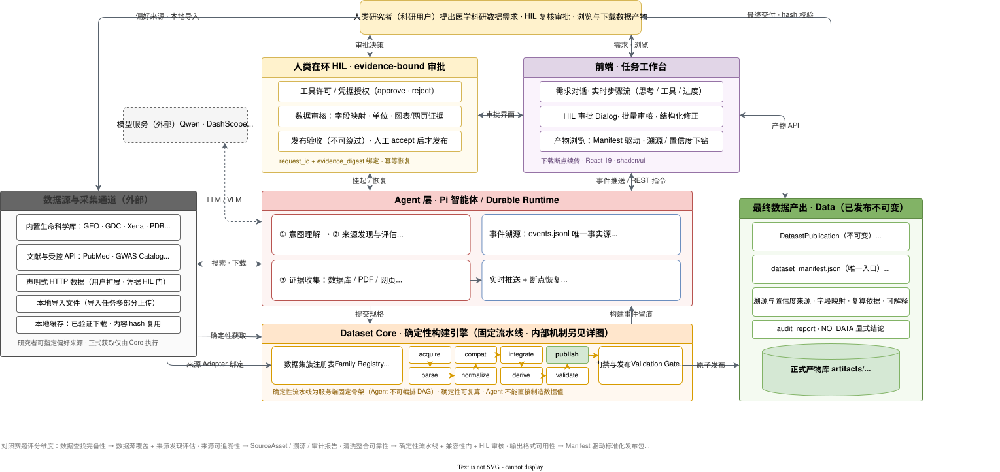
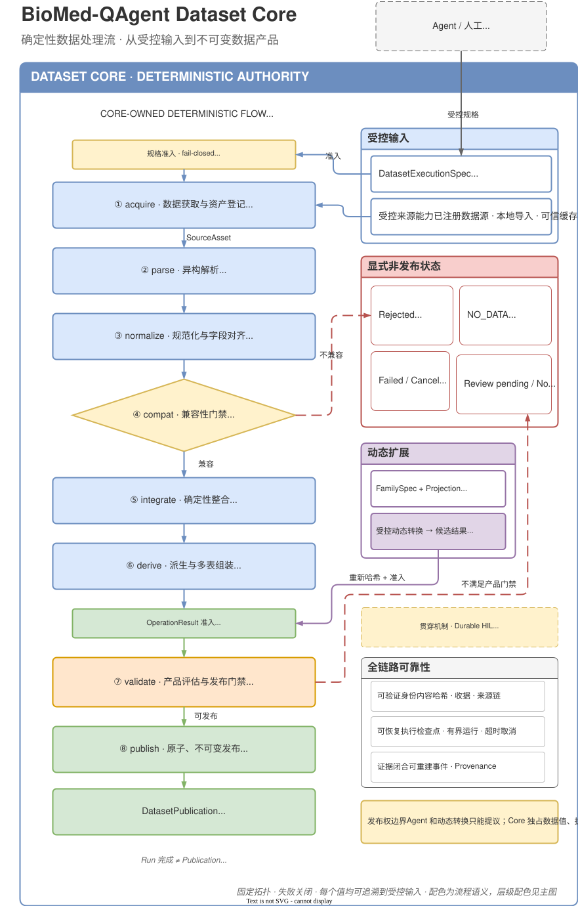

## 参赛作品简介

系统采用"开放式推理与确定性数据处理分权"的设计：Qwen 驱动的 Pi Agent（智能体）负责理解研究目标、发现候选数据来源并提交数据需求；TypeScript 编写的 Dataset Core（确定性数据核心）独占来源登记、解析、规范化、多源整合、质量门禁与正式发布。任务完成的标志不是聊天回答或工作区里的临时 CSV，而是一份不可更改的正式发布物（Publication）——除数据表与字段定义（Schema）外，还携带来源记录、质量记录与内容摘要，可随时复核。遇到不确定的字段映射、未知单位或低置信度抽取，系统会暂停并转为可持久化的人工确认请求；任务中断后从检查点恢复，不要求模型重新解释已确认的处理。系统支持多种静态数据产品，并以动态 Family（多表数据家族）协议覆盖静态注册表无法表达的复杂多表结构。

## 一、引言

### 1.1 真实科研中数据查找与整合的具体不足

在生物医学研究中，"找到数据"并不是搜索到一个网页链接。一个可用于下游分析的数据集至少需要同时回答：数据对应什么实体和样本、来自哪个版本、如何从原文件变成当前字段、不同来源能否在同一粒度上合并、哪些值存在冲突，以及哪些判断仍需研究者确认。现有工作流程主要存在以下不足。

第一，数据来源分散且检索接口异构。同一研究问题可能同时涉及 PubMed 或 Europe PMC 中的论文、GEO/GDC/Xena 中的表达数据、ClinVar/GWAS Catalog 中的变异证据、PDB/UniProt 中的蛋白信息，以及论文附件或网页下载。不同平台的查询语言、分页方式、访问限制、版本标识和返回格式不同。研究者往往能找到"相关页面"，但难以证明是否覆盖了应查来源、是否遍历了分页、是否遗漏补充材料。

第二，可读信息不等于可计算数据。论文中的 HTML、XML、PDF 表格、扫描图、折线图和补充 XLSX 需要不同解析方法。复杂表格还可能包含合并单元格、跨页表头、脚注、单位信息和缩写。视觉模型可以读取图表，但模型输出本身具有非确定性，若不保留页码、边界框、模型身份、提示版本和置信度，就难以复核。

第三，多源数据的语义不自动一致。相同列名可能代表不同测量语义，不同列名也可能代表同一概念；基因、探针、变异、化合物和样本各自有不同标识体系。以表达数据为例，probe-level 与 gene-level 具有不同的行粒度，原始强度、归一化表达量和对数值不能仅凭列名直接拼接。以生物活性数据为例，同一化合物的跨库 identity、实验类型和活性单位需要显式交叉映射与冲突记录。

第四，人工复制整理难以复现。常见流程是在浏览器、Excel、脚本和聊天窗口间复制内容。即使最终得到 CSV，也常缺少原始文件摘要、检索条件、字段映射、被拒绝行、冲突处理和处理程序版本。后续发现错误时，研究者难以判断应修改哪一步，只能重新整理。

第五，一次性问答无法承担长流程状态。科学数据任务可能因下载、权限、人工确认或服务故障跨越多个会话。普通问答把中间状态留在上下文窗口中，一旦超时或重启，模型容易重复下载、改变处理口径或忘记用户已确认的修正。

### 1.2 相关工作与差异定位

先简要回顾四类直接相关的工作。科学数据检索方面，PubMed、Europe PMC 等文献平台与 GEO、GDC、PDB、UniProt、ClinVar、ChEMBL 等专业数据库提供标识稳定、字段规范的入口，但跨库研究仍需研究者手工串联查询条件与下载文件；通用网页搜索能发现未被 API 暴露的页面和附件，但搜索排名不等于科学数据覆盖率，网页内容也不能自动成为正式证据。科学数据解析方面，规则解析器对固定格式更可复现，却难以覆盖布局复杂的非结构化内容；OCR、表格理解与视觉语言模型覆盖面更广，但会引入识别和语义误差。多源整合与溯源方面，传统 ETL 擅长把预先登记的来源映射到固定目标仓库，难以覆盖本作中运行时才确定的开放式来源集合。LLM 辅助数据处理方面，检索增强生成、工具调用与 ReAct 类方法让模型能够在回答前搜索外部信息并调用工具，但直接让模型生成或改写正式数据会面临幻觉、不可重复与长流程状态脆弱等问题。

与上述研究脉络并行，三类工程系统已各自成熟。本作的贡献不在重复它们，而在组合与收紧：

| 相邻系统 | 已提供 | 本作的差异 |
| --- | --- | --- |
| LangChain / AutoGen 等 Agent 框架 | 模型规划与工具执行的通用分离 | 分权只停留在调用层：执行器返回什么，结果就是什么。本作把分权进一步收进数据信任边界——只有注册过的解析器（Adapter）能进入 Core 的固定八阶段，无法证明正确的结果一律拒绝（fail closed，拿不准就拒绝），任务完成只能是不可变的正式发布物 |
| DocETL / Palimpzest 等声明式 LLM 数据管线 | 以自然语言规格表达的语义算子（map/filter/join）与管线自动优化 | LLM 算子与最终产物之间没有信任边界，"完成"只是"流水线跑完"。本作的模型只产生候选与规格，模型提议的表结构必须通过预检和闭世界准入（只接受有注册规则或绑定证据的变更）才被采纳（创新点二） |
| W3C PROV / FAIR / OpenLineage | 溯源关系的表达模型、数据可查找可复用的评价原则、跨工具 lineage 事件标准 | 能表达和观测"溯源应该长什么样"，但不生成、不校验，也不阻止没有溯源的发布。本作的溯源是数据流强制产生的副产物，并像供应链软件验收那样按清单逐件验证（SLSA 式）——缺少溯源覆盖即验证失败，每次读取都重算摘要，不匹配就拒绝展示 |
| Temporal / Airflow 等持久化工作流引擎 | 检查点、重试、可恢复执行与人工任务节点 | 恢复的是通用流程状态，人工任务不与证据绑定。本作的人工确认（HIL）恢复时要求证据摘要与任务身份一致（见 1.6），发布验收不可绕过，修正后发布新版本（supersedes 关系）并保留旧版本历史，而不是覆盖 |

本作品的区别在于：模型承担需求理解、来源探索与规格选择等开放性语义工作，Dataset Core 独占正式数据变换与发布权，用一条强约束的证据闭环覆盖数据生命周期，使研究者能知道"数据从哪里来、如何变成现在这样、哪些地方仍不确定"。因此，本作品更适合定位为一个"可信科学数据编译器"：自然语言研究需求是输入，具有表结构、来源、质量记录和发布回执的数据产品是输出。

### 1.3 本作品希望解决的问题

BioMed-QAgent 的目的不是"替研究者得出科学结论"，而是赛题明确提出的上游问题：将自然语言研究目标转换为一份可以继续分析、可以追溯来源、可以检查质量并可以在反馈后修正的结构化科学数据产品。

系统试图解决四个连续问题，四者依次覆盖"Agent 外部工作 → Dataset Core 确定性流水线"的主链路：

1. 根据研究目标定位合适的论文、数据库、附件、表格或图像数据（Agent 侧的需求编译与来源发现）；
2. 把异构载体解析为明确表结构和行粒度下的规范记录（Core 的解析、规范化阶段）；
3. 在不掩盖缺失、重复、单位差异和身份冲突的前提下完成多源整合（Core 的兼容、整合、派生阶段）；
4. 将每一步的来源、输入摘要、处理版本、质量判断和人工修正一起发布，使结果能被验证和复用（Core 的校验、发布阶段与可持久化的人工确认）。

系统有意不把科研分析和结论生成纳入正式完成标准。这样既符合赛题 1A 的任务边界，也避免将"数据是否正确"与"模型解释是否听起来合理"混在一起。相应地，系统的工程投入集中在赛题要求的核心链路——来源发现与覆盖、异构解析、清洗整合、图表提取与全链路溯源——其逐维度实证与边界见第五章。

### 1.4 研究问题与数据需求

本文要解决的核心问题是：用户以自然语言提出的研究需求，能否被系统可靠地转换为一份定义明确、过程可控、结果可复核的数据交付？回答这一问题需要明确两件事：一是系统应从需求中提取并固定哪些关键信息，二是一份合格的结果必须满足哪些条件。

用户输入最初只是一段自由文本，可能存在多种解读方式。为了避免歧义，系统并不试图穷尽地形式化用户的全部科学意图——那样做既不可能，也没有必要——而是只固定那些"一旦改变，数据产品的含义就会随之变化"的关键选择。这些选择共有十项，共同构成本次执行的数据集规格，在实现中对应 DatasetExecutionSpec（数据集执行规格）结构：

1. 数据产品类别：本次需要的是哪一类数据产品；
2. 行粒度：表中每一行代表什么观测或统计单位；
3. 目标表结构：交付表包含哪些字段及其组织方式；
4. 实体集合：分析涉及的对象是谁、范围多大；
5. 队列与筛选条件：按什么标准纳入或排除样本；
6. 来源与采集绑定：数据取自哪个外部库或文件、采用何种访问方式；
7. 规范化配置：采用哪套标准化流程及参数；
8. 合并策略：多个来源出现重叠或冲突信息时按什么规则取舍；
9. 验证配置：用哪些规则和阈值判断质量是否达标；
10. 输出格式：最终以什么格式交付。

明确这十项之后，同一份需求就可以被反复执行、逐项核对和事后审计，不会因表述含糊而产生不同的结果。

相应地，系统的交付物也不是一张孤立的数据表。一个合格的候选结果必须同时包含六类信息：

- 数据本身：可以是单张表，也可以是由主外键关联的多张表组成的集合；
- 表结构：各表的字段结构与约束；
- 溯源信息：数据来自哪些来源，每条记录在原始数据中如何定位；
- 审计记录：完整保留处理过程中被丢弃的数据、检测到的冲突以及所做的修正；
- 验证结果：各项质量门的判定结论；
- 文件清单：逐一登记正式交付的文件及对应的 SHA-256 校验值。

候选结果只有在通过全部质量门检查后，系统才生成一份不可更改的正式发布版。这样设计的目的在于：使用者不仅能直接基于表格开展分析，还能逐项查证数据的来源与处理过程，保证交付物可追溯、可复现。

### 1.5 主要贡献与创新点

本文将实际完成的功能归纳为三个贡献，三者共享同一基底：从来源字节到发布物的全链路内容寻址、逐件 SHA-256 与读取时重验，即贯穿第四章八阶段流水线的证据链。

创新点一：把"任务完成"变成机器可验证的事实，而不是模型的自述。 结果分为三层——工作区暂存、Core 候选、正式发布——只有第三层不可变化的发布物才算完成；Agent 的提示词中写死完成契约，运行时把"本任务还没有正式发布物"的进度真相持续喂给模型；运行的终态是"拿不准就拒绝"（fail closed），所以"运行结束"不等于"任务完成"。最近的研究把"模型虚报执行完成"称为执行幻觉，并视其为 Agent 可靠性的核心风险；本作给出的是结构性对策，而不是多写几句提示词（机制见 3.2、3.5.1、4.7、4.8；实证见 gold8 的零编造阻断与 gold7 的 v1→v2 自检换版）。

创新点二：多表结构可以"申请进入"，但决定权始终在 Core。 当预定义的数据家族覆盖不了所需的多表结构时，Agent 可以提交一份动态规格（FamilySpec）提议；提议先做无副作用的预检（输入角色是否闭环、表结构与字段是否可物化、声明的输出是否精确闭合），再由独立变换方在隔离区产出候选文件，最后由 Core 以闭世界校验（只接受有注册规则或绑定证据的变更）和逐文件重算摘要统一把关。变换方永远不能选择校验、评估或发布模块，这一分层由架构守卫测试在代码层强制。因此，开放输入能力并不会扩大写入权限（机制见 3.3 与第四章 B 路线；实证见 gold7 预检 11 次结构化拒绝后的正式闭环）。

创新点三：把人工判断纳入可恢复的闭环。 遇到模糊的字段映射、未知单位、低置信度抽取等无法安全自动决定的问题，系统暂停为可持久化的人工确认请求；研究者反馈后，系统从同一状态恢复并形成可追溯的新版本，而不必整体重做（机制详见 4.9）。Temporal、Airflow 等工作流引擎也提供持久化执行与人工任务节点；本作的差异在于"审批与证据绑定"：每个请求携带覆盖其审批对象的证据摘要（evidence digest），响应与任务身份不匹配就不得恢复；发布验收是阻断式的、不可绕过，修正后通过 supersedes 关系形成新版本而非覆盖（对照见 1.2 与 4.9）。

## 二、问题定义

### 2.1 任务边界

本系统支持的核心任务是：给定医学研究对象和数据需求，发现并采集一个或多个科学数据来源，将其转换为统一的单表或多表结构，保留来源和处理记录，并输出便于后续分析的 CSV 数据产品。

相应地，本系统不把下列事项作为正式交付承诺：自动提出并验证科学假设、替代领域专家判断数据科学含义、对研究结果给出医学结论、保证互联网范围的绝对查全、将模型抽取值自动升级为高可信事实。这些事项的完成标准要么依赖未封闭的科学判断（假设验证与医学结论），要么超出可证明范围（绝对查全），要么会把低可信抽取误升级为事实；系统以结构化阻断或边界披露处理它们，而不是以对话措辞假装完成。

### 2.2 设计目标

1. 可用性：输出为明确表结构下的 CSV 单表或多表，可直接进入 R/Python/统计软件或后续知识图谱流程（由发布阶段的发布清单统一承载）。
2. 可追溯性：每个正式来源绑定文件摘要和来源身份；记录尽可能携带可返回原载体的定位信息（由采集阶段的来源资产与定位信息承载）。
3. 可靠性：解析、规范化、整合和发布由注册代码执行；缺失、重复、冲突和单位问题显式记录（由注册解析器与确定性流水线承载）。
4. 可修正性：需要研究者判断时暂停并请求结构化输入；反馈后从同一任务状态恢复（由可持久化的人工确认承载）。
5. 可恢复性：下载和长流程操作可重试；已完成且摘要一致的阶段可从检查点复用（由事件日志与检查点承载）。
6. 能力诚实性：工作区暂存、正式候选和已发布产品分层；系统不能以对话措辞替代发布证据（由三层产物模型承载）。
7. 可扩展性：固定数据家族覆盖成熟高频场景，动态数据家族在严格协议下表达未注册多表拓扑（由数据家族注册表与动态规格协议承载）。

系统重点防范以下失败：来源 URL 或版本漂移；下载中断或内容类型错误；字段映射模糊；单位、尺度或行粒度不兼容；重复与冲突被静默覆盖；模型输出无证据；任务重启后重复或改变处理；过期执行晚到发布；正式文件被修改后仍被展示。

这些问题并非都能被自动"修复"。项目的目标是自动解决确定性问题，对无法安全判断的问题进行阻断、降级、记录或请求人工输入。

## 三、Core 外部：系统组成与 Agent 设计



BioMed 的整体设计遵循一个核心原则：开放式理解交给 LLM，正式数据改变交给确定性 Dataset Core，两者通过声明式规格与事件日志耦合，使"找到什么、怎么解析、如何清洗、从哪里来、输出成什么"都可检查、可回溯。主图给出整体分层与赛题评分维度的对照；本章描述 Core 之外的部分，Dataset Core 内部的固定流水线在第四章展开。

### 3.1 系统组成总览

围绕主图自外向内，系统由五个部分组成，Dataset Core 居于中央、是唯一的数据信任边界：

- 前端任务工作台：需求对话、实时步骤流（思考、工具调用、进度）、人工确认对话框（批量审核、结构化修正）、发布物浏览与溯源/置信度下钻。（界面截图待补充）
- 模型服务（外部依赖）：Qwen 主对话模型与 Qwen-VL 图表提取经 DashScope 调用；模型只提供理解、候选与提取，不产出正式数据值。
- Agent 层（Pi 智能体 + 可恢复运行环境）：完成意图理解、来源发现与评估、证据收集，并把结果固化为数据集执行规格提交 Core（唯一入口）；全程以事件日志（events.jsonl）留痕，支持实时推送、检查点续跑与下载断点续传。
- 数据源与采集通道：内置生命科学库（GEO、GDC、Xena、PDB、PubChem、Reactome、ChEMBL、UniProt 等）、文献与受控 API（PubMed、GWAS Catalog、dbSNP、MGnify、openFDA、PMC 等）、用户扩展的声明式 HTTP 数据（需凭据授权）、本地导入文件与本地缓存（已验证下载按内容摘要复用）。研究者可指定偏好来源，但正式获取只由 Core 执行。
- 人类在环：证据绑定的三级审批贯穿系统内外，其中发布验收不可绕过（机制见 4.9）。

### 3.2 三层产物模型

系统把结果分为三层：

1. 工作区暂存结果：搜索下载、模型阅读、探索脚本或 provisional CSV，可帮助 Agent 工作，但不具有正式可信语义。
2. Core 候选结果：来源已登记，处理步骤有操作收据，候选表具有表结构、溯源和验证报告，但仍可能因质量门或人工确认未完成而不可发布。
3. 正式发布结果：通过发布门后形成不可变目录，包含发布清单、数据表、表结构、溯源、审计、验证与文件 SHA-256。产品界面只应把这一层视为任务完成。

该分层是项目区别于"Agent 生成 CSV"的关键，也是 1.5 创新点一的机制基础。它使"文件存在""候选有效"和"正式可交付"成为三个可检查状态。这三层直接服务赛题"清洗整合可靠"与"输出格式可用"两项标准：只有到达第三层的对象才携带表结构、溯源与验证，下游脚本可以依赖其结构而无须信任聊天输出。

### 3.3 研究需求编译

Agent 首先把用户问题中的目标实体、数据类型、样本或队列条件、必需字段、期望粒度和输出要求整理为结构化需求；随后必须执行一次"路线检查"，查看当前注册表支持哪些数据家族、表结构、来源和解析器组合，以及动态路线可以直接绑定的数据提供者。

需求编译不是一次自由文本改写，而是形成数据集执行规格（DatasetExecutionSpec）的过程。服务器对规格做交叉校验：数据家族与表结构是否已注册、行粒度与目标实体层级是否一致、每个来源绑定对应的提供者/解析器/参数是否合法、规范化/合并/校验配置是否在白名单内、输出格式是否受支持、多表输入的角色关系是否闭合——校验不通过即阻断或要求修正。

如果注册表能精确表达需求，Agent 走静态路线；如果静态结构不匹配，但所有输入都能由 Core 的提供者获取（或已是任务拥有的来源资产），可走动态路线。两条路线都无法闭合时，系统只交付明确标记为暂存（provisional）的结果并列出缺失的正式能力，绝不伪装成正式发布。

### 3.4 候选来源发现

来源发现由 Agent 的查询策略和专用工具共同完成，采用多路召回：文献 API、专业数据库、补充材料归档与通用网页搜索并行，同一主题从多个互补通道交叉验证。当前代码覆盖文献、表达组学、变异、药物与生物活性、蛋白与通路、临床试验、微生物组及通用网页等通道。发现阶段的目标是确定候选编号（accession）、论文、数据集、附件和下载入口，并理解其字段与范围。

用于回答"是否在问题子领域内查全"的 SourceCoverage 覆盖证据已列入开发计划（先在数据契约中定义稳定的通信结构，由 Core 生成检索计划与覆盖结果），记录字段至少包括检索站点与查询式、时间窗口、命中数与去重后候选数、最终进入正式采集的编号/附件、排除原因和检索时间；覆盖只在预先定义的源集合内计算，Agent 文本不得自行宣称"全网查全"。

### 3.5 LLM 使用方法与上下文工程

本节展开 Agent 侧（Dataset Core 外部）LLM 使用与上下文工程的实现细节，对应 1.5 的创新点一；其中证据上下文控制（3.5.4）与第四章验证阶段的确定性上限、人工确认直接衔接。

#### 3.5.1 系统提示中的完成契约

Agent 系统提示把"任务完成"约束为可验证状态，而非自然语言自报。对于数据生产请求，Agent 必须先检查可用执行路线；正式成功需要取得正式发布物或明确的产物清单。若只能形成工作区 CSV，则必须标记为暂存并说明正式路线为何无法闭合。

该完成契约减少三类常见幻觉：

1. 工具调用返回了几行预览，模型就宣称"数据集已完成"；
2. 文件写进工作区，模型就把它称为正式发布；
3. 某个来源失败，模型省略失败项并给出"已完整检索"的结论。

约束不止于提示词。运行时每回合注入由事件溯源（把每次操作追加进事件日志、可据此重建状态）投影压缩而成、有硬预算上限（不超过约 520 字符）的进度上下文，显式告知"本 run 尚无不可变发布物""仍有工具在执行、不得假设其结果""存在未解决失败"——把完成与否的真相锚定在数据产品的存在性上，而不是模型对自身行为的记忆。

#### 3.5.2 路由预检与声明式工具 Schema

BioMed QAgent 系统向大模型暴露当前真实能力与相关参数。静态路线要求精确匹配注册表；动态路线只接受预检报告为可绑定的输入。工具 Schema（参数结构）限制字段类型、枚举、对象结构和必要参数，服务器端再做交叉验证。

上下文工程的重点不是把所有代码塞进提示词，而是把模型作决策所需的最小权威信息放进上下文：

- 当前任务与研究目标；
- 可用工具及其严格输入结构；
- 注册表返回的数据家族/表结构/提供者能力；
- 来源搜索结果和失败回执；
- 校验问题、人工确认选项与证据摘要；
- 当前发布物或阻塞状态。

这样可以把"模型知道什么"绑定到运行时实际能力，减少提示词与代码版本漂移。

#### 3.5.3 Skill 与专用工具

专用数据库工具封装查询、分页、下载与来源特有字段，使 Agent 不必为每个站点编写任意脚本。声明式数据库 Skill 可以扩展数据源描述，但不应绕过网络策略、资产登记或正式解析器。工具层返回结构化结果和错误，Agent 据此调整查询或向用户报告缺口，从而能在"选择和组合能力"上发挥作用，同时保持底层 I/O、权限和数据变换可审计。

#### 3.5.4 证据上下文与不确定性控制

模型不应仅看到最终值，还应看到该值的来源类别、定位信息、解析层级和置信度。对于非确定性抽取，系统以类别置信度、原因、模型身份和复核状态表示不确定性，并在 Core 中设置可信度上限。

字段映射和单位修正也采用相同原则：模型可以提出候选，但只有注册规则或绑定证据的人工决定可以改变正式数据。

## 四、Dataset Core：确定性八阶段流水线

Dataset Core 是系统唯一的数据信任边界：八阶段固定流水线 acquire → parse → normalize → compat → integrate → derive → validate → publish（采集 → 解析 → 规范化 → 兼容性检查 → 整合 → 派生 → 校验 → 发布），每一步都有显式输入、操作收据、输出摘要与失败语义。Agent 不能编排执行路线，也不能直接制造数据值；动态 Family（多表数据家族）在严格协议下扩展"能读什么"，而不扩展"能写什么"。



详图展开 Core 内部：A 路线是已注册数据家族的固定操作骨架；B 路线是动态规格——变换方只交付候选字节，经隔离区与 Core 准入校验（重新计算摘要、闭世界检查）统一把关，且不能选择校验、评估或发布模块（创新点二的机制基础）。八阶段运行在共同的全链路可靠性基座上：内容摘要与可信收据、检查点与重放身份、超时/取消与执行锁、可持久化事件日志与可重建状态、证据绑定的人工确认（见 4.9）。流水线之外，系统以显式终态保证"运行完成 ≠ 正式发布"（拿不准就拒绝：Rejected / NO_DATA / Failed / Cancelled）。以下按八个阶段依次说明。

### 4.1 阶段1 acquire：正式采集与来源资产登记

发现阶段拿到 URL 后，正式路线并不直接信任 Agent 工作区里的任意文件。Core 的采集提供者决定请求的 URL、方法、请求头、媒体类型和允许参数，并通过统一下载设施执行网络访问。下载层包含 URL/DNS 策略、大小限制、超时、重试、断点续传与内容缓存等机制，用于降低 SSRF（服务端请求伪造）、无限下载、网络抖动和重复获取等风险。

文件写入任务专属的来源资产目录后，来源资产注册表流式计算 SHA-256 并生成内容身份。注册信息至少绑定：任务与资产角色、文件字节数/媒体类型/SHA-256、来源 ID 与规范编号、提供者与采集实现的身份摘要，并在支持时记录快照身份或修订号等版本证据。注册表拒绝目录逃逸、符号链接和跨任务资产复用。因此，"来源资产"不是一个本地路径，而是任务、来源、内容与采集实现共同绑定的输入证据。

### 4.2 阶段2 parse：异构数据解析

#### 4.2.1 结构化与半结构化来源

正式静态路线使用已注册的解析器（Adapter）。解析器把来源特有的 CSV、JSON、XML、XLSX、SOFT、矩阵或 API 响应转换为数据批次（DataBatch），同时输出解析统计、被拒绝的记录和溯源定位信息。对于来源格式异常，解析器应失败或把问题写入审计记录，而不是让 Agent 猜测缺失字段。

表达数据的解析器需要识别样本列、实体标识、测量值和表达语义。例如 GEO 既可能提供 gene-level 结果，也可能只提供 probe-level 矩阵；系统不会在缺少可信注释时直接把探针当成基因。GDC 与 Xena 的输入形态不同，但都需要转换到目标表达表结构后才可合并。

注册式多表数据家族则将每个来源表映射到明确的表定义，并在后续组装阶段检查关系（多表示例见 4.6）。

#### 4.2.2 PDF 表格

PDF 解析保留页面和位置证据。对于可提取文本的表格，可依据文本块位置聚类形成行列，并记录 page、bbox、caption 或降级警告。无框线表格、合并单元格、旋转页面和跨页表头仍是启发式解析的难点，应在 Gold 案例中单独标注复杂度并人工核对。

#### 4.2.3 图表与视觉模型

图表工具采用多层降级：优先通过 Qwen-VL 理解页面图像或嵌入图像；失败时尝试 PDF 表格；再失败时提取标题（caption）作为有限信息。模型抽取结果必须携带模型名，点级结果包含置信度与置信度原因；其可信级受 4.7 的确定性上限约束，不会因模型自报 high 而自动成为正式真值。

VLM/PDF/caption 的抽取结果先固化为任务所属、摘要绑定的图表证据资产（chart evidence asset），再进入生产 bioactivity_measurement 数据家族的图表四表（注册解析器与组装分派）；点级溯源与复核门在组装前"拿不准就拒绝"，未通过时写入结构化 chart_evidence_gate 检查并阻断发布，不会让任意工作区 CSV 直接获得正式发布权；通过后经既有验证与原子发布路线产出正式发布物，人工修正（HIL correction）保留原始值并记录 human_correction 步骤。

坐标轴与图例的正确性由确定性门禁而非模型自报约束：chart_series 表记录轴名、轴单位与刻度（x_scale/y_scale）和图例文本，并须声明轴/图例校验状态（`axis_validation_status` / `legend_validation_status`，取值 clear / unclear / human_validated）；声明为 exact 的数值点一旦对应轴或图例语义 unclear 即直接判失败；系列允许省略点数据的唯一条件是轴或图例状态明确标为 unclear（确认不了就如实标记，而不是猜测填点）；单位 token 另受保留规则锁定，防止发布中漂移。该链路已有对应的点级 Gold 闭环测试（`server/tests/chart-evidence-publication-closure.test.ts`）：accepted 与 corrected（人工确认）两条路径均产出正式发布物并逐件重算 SHA-256；pending 复核或缺表则写入 `chart_evidence:chart_evidence_gate` 检查并"拿不准就拒绝"，不产生任何发布物。

### 4.3 阶段3 normalize：语义规范化与缺失、重复处理

解析后的来源记录仍不能直接拼接。规范化器（Canonicalizer）按目标表结构完成类型转换、规范字段命名、实体标识表达和必要的值标准化。其核心原则是：只有被目标表结构和规范化配置授权的变化才可以自动执行。

字段对齐处理来源列名到规范字段的映射、类型转换、缺失标记统一、实体 ID 与命名空间表达、单位与测量语义检查、probe-to-gene 等外部映射资产转换，并保留原始写法与规范值之间的血缘（lineage）。缺失与重复也在本阶段按类型处理：必填字段缺失时拒绝或阻断，可选字段缺失保留为空并计入完整性统计；完全重复按确定性键去重；主键重复且值一致时合并血缘、保留多来源。每类处理都保留对应证据（定位信息、来源集合等），使后续可复核。

对于 probe-to-gene，映射资产本身也需要来源资产与摘要。未映射探针、一个探针对应多个基因、注释与表达平台不匹配等情况应进入覆盖、拒绝或歧义记录。Gold 案例应报告映射覆盖率，而不能只展示最终成功行。

实体身份对齐同样坚持确定性机制而非模型猜测：化合物以 InChI Key 精确匹配建立交叉映射表（如 ChEMBL↔PubChem，匹配方法 exact_inchi_key，匹配不上时显式标记为冲突而不是强行合并）；基因符号归一有内置确定性映射表，也可使用注册的外部规范资产（如 HGNC current，见 gold9）；probe→gene 如上依赖逐平台注释资产，未映射探针保留原命名空间、不静默丢弃。

### 4.4 阶段4 compat：兼容性门

兼容性门是解析与规范化产物进入整合前的最后一道静态检查：核查各批次在数据家族、表结构、行粒度、实体层级、单位、语义和尺度上是否可合并，并按可计算的测量身份（值语义、值尺度、单位）与十二维语义（模式、行粒度、物种、特征命名空间、测量类型、规范化状态、参考版本等）生成确定性的合并域键——任何一维不一致，都不能进入同一合并域。未知单位、未知值语义或不受支持的数值尺度，不会被模型凭常识悄悄修正；单位不一致时，只在有注册转换公式时换算（公式只接受注册的线性安全形式：value、value±o、value×f(±o) 与 value/d）；没有注册规则时，系统宁可阻断，或经人工确认请求请研究者选择合法的修正。失败语义是显式拒绝，而不是静默放行。

### 4.5 阶段5 integrate：多源整合与冲突审计

对同一规范表结构的批次，整合器按注册的合并策略合并，并在最终 source-of-record 行上重新汇总血缘和置信度。合并时的冲突按注册策略处理：主键重复且值冲突时保留 source-of-record 并写冲突审计，必要时阻断；实体身份冲突不强制合并而保留交叉映射表；统计异常作为警告或人工核查信号，不默认自动改值。

当前表达整合采用确定性策略：冲突时 first source wins 保证可复现，但不构成科学裁真，因此冲突审计随正式产物交付，裁真保留给研究者与人工确认（边界定性见 5.8）。

### 4.6 阶段6 derive：多表组装

对于需要多实体关系的数据，数据家族的组装阶段生成多表候选，并检查主键、外键、基数和表角色。

单表与多表是规格层可选形态：需求本身是单一粒度观察时（如 gold8 的 FAERS 计数）交付单表；需求横跨多个实体层级时（如 gold7 的研究-位点-映射、gold9 的基因-疾病-证据）才拆分多表——以生物活性数据为例，拆分为 activities（测量值）、assays（实验条件）、compounds/targets（规范身份）、sources 与 compound crosswalks 等表，避免把不同粒度的观测压进重复严重的宽表。多表不是对宽表的排斥，而是为"哪些行可以合并、以什么键合并"给出可检查的答案：多表发布清单记录表、关系、溯源引用和置信度引用，下游按显式关系而非列名猜测 join key；对习惯合并宽表的下游统计流程，研究者可在目标表结构中把交付声明为单表粒度（如 gold8），宽表展平导出作为可选输出格式列入改进清单。

### 4.7 阶段7 validate：Validation、Confidence 与 ProductAssessment

校验配置（Validation Profile）对候选结果执行发布前检查，覆盖：表结构与字段类型、必填字段完整性与允许缺失率、主键唯一性与外键基数、实体标识命名空间与原始写法保留（token preservation）、单位/数值尺度/允许语义、溯源与来源定位覆盖、置信度记录与最终行对齐、产物摘要闭合，以及可复现所需的输入与实现身份。

多表产品评估（ProductAssessment）从结构、关系、标识、溯源、置信度与可复现性六个维度评价产品。无阻断项时可达 publishable（可发布）；只存在可复现性阻断项时至多为 validated（已验证）；存在语义阻断项时为 incomplete（不完整）。这使得"CSV 能打开"与"数据产品语义上闭合"不再是同一件事。

置信度按证据类型受到上限约束。确定性、受版本约束的解析可以获得较高可信等级；VLM、LLM、OCR 和网页抽取等非确定性来源最高封顶为 medium，并可按记录进入人工审核。系统关注的是"该记录由何种证据和处理产生"，而不是让模型自由输出一个看似精确的概率。

验证结论还与显式终态绑定：Rejected、NO_DATA、Failed、Cancelled 四类终态相互独立且"拿不准就拒绝"——空主数据、兼容性失败或验证失败的结果一律不可发布，"运行完成"不等于"发布物生成"。

### 4.8 阶段8 publish：不可变发布与消费时重验

发布器把通过质量门的候选复制到独立目录，生成发布清单（Manifest），并为每个文件记录相对路径、媒体类型、字节数和 SHA-256。典型正式产物包括主数据集与辅助数据集 CSV、表结构、溯源、审计/校验报告，以及发布清单与发布回执。

发布采用临时目录与原子切换，发布前检查执行锁与"代次围栏"（generation fence），防止超时或取消后的旧操作晚到覆盖新结果。产品 API 在读取时重新验证发布清单与文件摘要；若文件被修改或损坏，返回错误而不是继续展示。

### 4.9 Durable HIL 与可恢复执行

人工确认（HIL）不是系统的第一反应，而是自动路径穷尽后的收口：遇到模糊的字段映射、未知单位、低置信度图表点等，Core 先尝试注册的确定性规则与候选推理，只有无法安全闭合时才创建结构化请求——例如单位换算先查注册公式表，命中即自动应用、不进入人工确认，仅当无规则可依时才暂停；图表审核只针对低置信度记录发起。请求携带逐项候选值（proposed_value）与置信度（confidence_level）、相关记录、证据摘要和任务/运行/需求身份，前端以"在候选与证据概要上选择"为主、自由修正为辅（approve / reject / correct）；响应只有在证据摘要和任务身份匹配时才可恢复原操作。

典型人工确认场景包括字段映射存在多个候选、未知单位或测量语义、probe-to-gene 映射歧义、低置信度图表点确认、动态数据家族候选是否接受为正式产品，以及冲突记录需指定保留策略等。

从审批对象看，人工确认覆盖三级：工具许可与凭据授权（approve/reject）、数据审核（字段映射、单位、图表与网页证据）、发布验收。其中发布验收不可绕过——只有人工 accept 后系统才执行发布，这与"Core 独占发布权"互为表里。

HIL 不是聊天中的一句"请确认"。请求和决策均落盘，进程重启后可以确定性恢复。恢复本身也是确定性的：系统持久化审批挂起时的原始工具调用，恢复时以原调用重放并由执行器从检查点续跑，零 LLM 参与；主机重启后无法确定性续跑的发布验收直接判整 run 失败，悬空的权限请求一律清算为拒绝——宁可失败，也不留下可被事后批准的悬空授权。对于数据更正，系统应重新执行受影响阶段并发布新版本，通过 supersedes 关系保留旧版本历史，而不是覆盖原发布物。

除人工确认外，可靠性基座还包括：内容哈希与可信操作收据（每个阶段的显式输入、输出摘要与失败语义）、操作检查点与重放身份（已完成且摘要一致的阶段可复用）、超时/取消与执行锁/代次围栏（过期执行不得晚到覆盖）、可持久化事件日志与可重建投影（全程留痕、崩溃后重建状态）。配合 4.7 的显式终态语义，它们共同保证长任务可续跑、错误可定位、结果可复算。

## 五、实验与案例

本项目整理了 10 份参考输入输出样例，用于检验模型能力。完整问题列表如下：

| 案例 ID | 研究主题 | 主要来源 | Gold 规模（目标表） | 主要难点 |
| --- | --- | --- | --- | --- |
| 1 | 乳腺癌肿瘤 vs 正常组织 GEO 转录组表达整合 | NCBI GEO / E-utilities + GPL 平台注释 | datasets、samples、expression_long、probe_gene_mapping | 探针→基因映射、缺失、冲突、单位/尺度 |
| 2 | LUAD EGFR 突变表达的基因/探针双粒度整合 | GEO + 临床与 EGFR 突变注释 | study_records、sample_annotations、egfr_variant_records、probe_expression、gene_expression | probe→gene 双粒度、临床表型字段对齐 |
| 3 | EGFR NSCLC 靶点多源证据整合 | UniProt、NCBI Gene、ClinVar、RCSB PDB、PubChem、ChEMBL、ClinicalTrials.gov、COSMIC | gene_protein、variant、structure、drug、clinical_trial、entity_crosswalk | 跨数据库 identity 冲突与 crosswalk |
| 4 | SARS-CoV-2 Spike–ACE2 结构、序列与变异证据 | NCBI、UniProt、RCSB PDB、PubMed、Europe PMC | viral_protein、spike_variant、structure、interface、paper | 派生行不得冒充来源行、结构版本与 interface |
| 5 | EGFR 抑制剂 ChEMBL 活性与 PubChem 结构整合 | ChEMBL、PubChem | target、compound、assay、activity、compound_crosswalk | compound crosswalk、单位、identity 冲突 |
| 6 | EGFR 突变体抑制实验与论文图表提取 | PubMed / PMC / Europe PMC（PDB 仅校验） | paper、experiment、activity_value、chart_series、chart_points、supplementary_asset | 低置信度图表点阻断至人工、轴/图例校验、图表提取 |
| 7 | 阿尔茨海默病 GWAS 风险位点多源整合 | GWAS Catalog + Bellenguez 2022 补充材料 + dbSNP GRCh38 | study、variant、variant_gene_mapping | 补充材料 75 风险位点解析、坐标版本 |
| 8 | 药物性肝损伤（DILI）风险药物证据整合 | FDA DILIrank 2.0、LiverTox、openFDA FAERS | drug、livertox、faers_report_count、drug_crosswalk | 外部来源失效（DILIrank 404）、来源切换策略 |
| 9 | 原发性免疫缺陷基因-疾病-表型整合 | Orphadata、HGNC、ClinVar、ClinGen | gene、disease、association、cross_source | 疾病归一、跨源证据分级 |
| 10 | 肠道微生物组-疾病关联整合（T2D/IBD/CRC） | MGnify、GMRepo、病例对照论文、NCBI Taxonomy | study、taxon、differential_abundance、reference_prevalence | 动态路线闭合、分类学术语归一 |

以下展开第 7–9 条案例（gold7 / gold8 / gold9）。三者均在同一冻结代码提交（`e8d03589`）、单一 Host、同一评测协议下完成，分别代表三类典型难点：动态多表拓扑闭环（gold7）、外部来源失效下的部分维度发布与结构化阻断（gold8）、多源多表整合与跨源证据（gold9）。

### 5.1 案例评测协议与总览

为保证结果可复核，三个案例遵循同一评测协议：Agent 的输入只有案例 `TOPIC.txt` 原文（数百字节的研究需求描述，不含任何参考答案或人工整理数据）；代码冻结在单一提交；由一个有界外部监督程序（`scripts/gold-formal-supervisor.mjs`）驱动任务、把事件流持久化落盘、对发布产物逐件重新下载并重算字节与 SHA-256，最终给出终态分类（`succeeded_publication` / `blocked_no_publication` / `failed_or_cancelled`）。评测模型为 DeepSeek-V4-Flash（上下文窗口 1,000,000、最大输出 32,768、温度 0.2）——选择一个非 Qwen 的国产模型是为了验证系统的模型无关性；此前 gold8 亦在同链路上取得过 Qwen3.8-27B 的同类正式发布（`pub_dili_benchmark_faers_counts_852d6a0a4bcd531c`，2026-08-28）。

| 案例 | 研究主题 | 正式发布（Publication） | 交付物 | 校验 | 上下文峰值 |
| --- | --- | --- | --- | --- | --- |
| gold7 | 阿尔茨海默 GWAS 风险位点多源整合 | `pub_ad_gwas_risk_loci_integration_b51fdc25…` | study / locus / variant_gene_mapping 三表 + schema + provenance + 评估 | 逐件 SHA-256 通过 | 766,326 / 1M（76.6%） |
| gold8 | DILI 风险药物证据整合 | `pub_REQ_DILI_FAERS_COUNTS_fd56dd6f…` | faers_reaction_counts 主表 + schema + provenance + 评估（4 件） | 逐件 SHA-256 通过 | 380,287 / 1M（38.0%） |
| gold9 | 原发性免疫缺陷基因-疾病-表型整合 | `pub_iei_pid_v1_bafb191e…` | gene / disease / gene_disease / crosswalk 四表 + schema + provenance + 评估（7 件） | 逐件 SHA-256 通过；结构校验 67/67 | 750,739 / 1M（75.1%） |

三例全程零 shell/网络绕路、零权限暂停（权限面的停审-拒绝-恢复链路在更早轮次已单独验证）；上下文峰值均远低于窗口，未触发任何压缩。全部事件流、发布清单与重验记录保留在 `data/gold/` 评测证据目录中（gold7：`gold7_alzheimer_gwas`；gold8：`gold8_dili_drug_safety`；gold9：`gold9_iei_gene_phenotype`），每目录包含 TOPIC 原文、原始与中间产物、`provenance.json` 及 `runs-log.md` 逐 run 日志；监督程序的逐 run 事件日志见 `data/e2e-gold7-004…009-monitor.log`、`e2e-gold8-001-monitor.log` 与 `e2e-gold9-001-monitor.log`。

### 5.2 案例 gold7：阿尔茨海默 GWAS 风险位点整合（动态 Family 全链闭环）

**输入（TOPIC 摘要）**：以 Bellenguez 2022（PMID 35379992）等来源整合 AD GWAS 风险位点，输出研究、位点、变异-基因映射三张表，要求补充材料 75 位点表解析与 GRCh38 坐标核验。

**过程要点**：Agent 首步调用路线检查（`inspect_dataset_execution_routes`），确认静态注册表无任何数据家族能表达该三表拓扑后选择动态路线；随后经治理工具完成采集——GWAS Catalog REST 返回 GCST90027158 的 89 条全基因组显著关联；Europe PMC 官方补充通道取得 27,656,649 字节归档（SHA-256 逐字节登记后作为任务资产），Core 提取器将 XLSX 成员逐工作表转为溯源绑定的 UTF-8 CSV 资产；dbSNP 工具核验 GRCh38 坐标。正式发布前，动态预检拒绝了 11 次规格提交（角色映射、输入闭包、外键策略、字段形状等），每次均给出可操作的错误信息；Agent 修正后发布 v1，又自行发现 v1 的 GWAS 统计列未填充与解析缺陷，发布修正版 v2 并以替代关系保留 v1 历史——这一"自检-修正-换版"行为正是 4.9 节反馈修正闭环的实测样本。

**输出结构（v2，`study.csv` 1 行、`locus.csv` 88 行、`variant_gene_mapping.csv` 127 行）**：`locus.csv` 24 列，含双坐标基准对照（`position_grch38` 与补充材料 `position_grch38_supp`）、分层统计（`stage1/stage2/stage12` 的 OR 与 p 值）、异质性（`i2`/`phet`）与来源标记（`in_supp_75_loci`、`dbsnp_variant_type`）。真实样例行：

| 字段 | 值 |
| --- | --- |
| variant_rsid / risk_allele | rs141749679 / C |
| position_grch38 / _supp | 109345810 / 109345810 |
| p_value / odds_ratio / CI | 8e-9 / 1.38 / [1.24-1.54] |
| nearest_gene / known_locus | SORT1 / New |
| stage1_or · stage2_or | 1.37 (1.19-1.57) · 1.41 (1.17-1.7) |
| i2 / phet / in_supp_75_loci | 0 / 0.9019 / yes |

**来源清单**：GWAS Catalog 关联记录（GCST90027158）、Bellenguez 2022 补充材料（Europe PMC 官方归档，字节级摘要入链）、dbSNP RefSNP 记录。发布范围窄于参考全集——正式绑定的是单研究，映射基因全部来自补充材料——但每一行均可溯源、可重验；该范围取舍与其余边界见 5.8。

### 5.3 案例 gold8：DILI 风险药物证据整合（来源失效下的正确终态）

**输入（TOPIC 摘要）**：针对 DILIrank 2.0 vMost 药物整合三类证据——DILIrank 标签注释、LiverTox 专论、openFDA FAERS 肝毒性 PT 报告计数，约 50 种代表药、四表交付。

**关键难点与行为**：DILIrank 2.0 官方文件（`fda.gov/media/113052/download`）持续 404，LiverTox 无药物级结构化导出。系统的处理展示了赛题"自动识别缺失数据……完成修正或寻求人类建议"加分项的完整链路：第一轮运行在发现阶段确认官方来源不可达后**未编造任何行**，以工作区暂存 + 结构化阻断收尾，明确请求"提供官方文件或注册 Core 资产"；第二轮定向续跑把可达维度（FAERS 计数）正式化——9 个已验证药物各经一条 `openfda.files.v1` Core 采集绑定**重新获取**（发现阶段的查询输出不被当作正式载体），以动态数据家族发布。

这一"核实不可达 → 显式阻断 → 定向续跑 → 正式化可达维度"的降级链，把提案加分项"自动识别缺失数据并完成修正或寻求人类建议"落在数据链路的每个环节；不可达维度的替代源自动发现（从文献补充或其他官方通道补 DILI 证据，并把尝试过程计入覆盖证据）已列入改进项。

**输出结构**：`faers_reaction_counts.csv` 68 行 × 5 列（`drug_name, reaction_pt, report_count, retrieval_method, source_url`）。请求的 9 药 × 8 肝毒性 PT = 72 行中，4 行因官方聚合响应确无该 PT 词条而**未零填充**，逐条列出（如 azathioprine–HEPATOCELLULAR INJURY）；其余 68 行与发现阶段 openFDA 计数逐条一致（如 acetaminophen ACUTE HEPATIC FAILURE = 3297）。校验 16/16 通过（0 坏行、0 重复主键）、溯源 9/9 载体满足、`product_status=publishable`。每行 `source_url` 直接给出可复核的官方 API 查询串；`report_count` 的语义为 MedDRA PT 报告次数（非去重患者、非因果证据），已在终答与溯源中注明。

不可达的 DILIrank vMost 名册与 LiverTox 维度不进入正式发布，仅保留为明确标注暂存的工作区文件——"部分维度正式发布 + 不可达维度结构化阻断"是该上游条件下唯一诚实的完成形态，也是 4.7 节显式终态语义的一次实战兑现。其余边界见 5.8。

### 5.4 案例 gold9：原发性免疫缺陷基因-疾病整合（多源四表与跨源证据）

**输入（TOPIC 摘要）**：从 Orphadata 筛选免疫缺陷相关罕见病及基因关联，经 HGNC 归一为现行符号，整合 ClinVar 致病性变异计数与 ClinGen 有效性分类，输出基因、疾病、基因-疾病关联、跨源证据四表，以 `hgnc_symbol`/`orphacode` 关联，ClinGen Refuted/Disputed 冲突单独标记。

**过程要点**：Orphadata 两个大型 XML（en_product1 54,026,799 字节、en_product6 22,612,034 字节）经任务内容缓存命中（先前由同一官方端点获取并逐字节验证，摘要一致），零网络重取；HGNC、ClinVar、ClinGen 为本 run 真实网络采集。前两轮 run 因基础设施缺陷（浏览器渲染超大文件导致资源耗尽、会话取消路径无界等待）中断——两个缺陷均被定位并修复（渲染资源闸门、强制取消），续测一次通过，本身即 4.9/2.2 节"可恢复性"目标的工程实证。

**输出结构（四表）**：

| 表 | 行数 | 字段（语义） |
| --- | --- | --- |
| `gene_records.csv` | 213 | hgnc_symbol、hgnc_id、gene_name、alias_symbols、previous_symbols、locus_group、locus_type、status（HGNC 归一后的现行身份） |
| `disease_records.csv` | 269 | orphacode、disease_name、synonyms、disease_type、disorder_group |
| `gene_disease_records.csv` | 241 | orphacode、hgnc_symbol、orphanet_gene_symbol、gene_name、association_type、source（主表） |
| `gene_evidence_crosswalk.csv` | 241 | hgnc_symbol、orphacode、clingen_classification（+日期/疾病标签）、clinvar_count（+查询串）、conflict_flag、conflict_detail |

关联样例（`gene_disease_records`）：`567, TBX1, TBX1, "T-box transcription factor 1", "Disease-causing germline mutation(s) in; Role in the phenotype of", Orphanet en_product6`。结构校验 67/67 通过（候选引用闭合、逐表 schema 契约、主键唯一、外键关系、溯源覆盖等），`product_status=publishable`。

**来源清单（五个正式载体，溯源逐条登记回执、请求身份摘要与官方端点快照）**：en_product1（54,026,799 B，`df8d562a…`）、en_product6（22,612,034 B，`f1c039f7…`）、HGNC current（16,948,051 B）、ClinVar gene-esearch（460 B）、ClinGen current（1,119,208 B）。

本例闭合的是 Orphadata×HGNC 两源四表与完整的发布、溯源、验证链，而非 TOPIC 全部四源的数值级整合：crosswalk 中 ClinVar/ClinGen 数值列在发布表中为空——两个载体已获取并绑定，但数据变换未将值落入交叉表，而结构校验不检查可选列填充率，因此照常通过。团队复核后已将此偏差记入案例档案；该边界的定性、机理与改进项见 5.8。

### 5.5 可调用测试 API 与可交互前端

系统以 HTTP API 与 Web 前端同时暴露全部能力：

| 端点 | 方法 | 作用 |
| --- | --- | --- |
| `/api/v1/health` | GET | Host/运行时/Core 健康自检 |
| `/api/v1/tasks` | POST / GET | 创建任务（自然语言输入即 Body）/ 列出任务 |
| `/api/v1/tasks/{task_id}` | GET | 任务快照：状态、runs、artifact 数、当前发布指针 |
| `/api/v1/tasks/{task_id}/runs` | POST | 在既有任务上发起新 run（续跑） |
| `…/runs/{run_id}/cancel` · `…/resume` | POST | 取消 / 恢复（含权限与 HIL 恢复） |
| `…/runs/{run_id}/permissions/{request_id}` | POST | 权限裁决（approve/deny，绑定证据摘要） |
| `/api/v1/tasks/{task_id}/compact` | POST | 手动上下文压缩 |
| `/api/v1/publications/{pub_id}/artifacts/…` | GET | 发布物与逐 artifact 下载（消费时重验 SHA-256） |
| `/api/v1/settings` · `/api/v1/model-registry/*` | GET/PUT/POST | 模型供应商/模型注册、参数与激活（不锁定任何模型） |
| `/api/v1/ws` | WebSocket | 事件流实时订阅（工具调用、验证、发布事件） |

前端（React 19 + Vite + Tailwind）提供任务列表与创建、run 事件时间线、发布物查看（按当前发布指针渲染并重验摘要）、人工确认结构化问卷（字段映射/单位/发布确认等场景的 approve/reject/correct）、模型设置页。开发入口 `pnpm dev`（Host 8000 + 前端中间件），生产入口 `pnpm start`。三案例的完整复现命令（监督程序调用模板、缓存种子方法、单实例约束）已在仓库 `docs/plans/` 与 `docs/gold-formal-rerun.md` 固化。

### 5.6 结构化输出样例与字段说明

以 gold9 跨源证据交叉表为例（真实发布行）：

```csv
hgnc_symbol,orphacode,clingen_classification,clingen_classification_date,clingen_disease_label,clinvar_count,clinvar_query,conflict_flag,conflict_detail
TBX1,567,,,,,,NONE,
```

字段语义：`clingen_classification` 为 ClinGen 基因-疾病有效性分类（如 Definite/Strong/Limited；Refuted/Disputed 出现时触发冲突逻辑）；`clinvar_count` 为 ClinVar 该基因致病记录计数，`clinvar_query` 保留实际查询串以供复核；`conflict_flag` 取 `NONE` 或 `CONFLICT_CLINGEN_REFUTED_OR_DISPUTED_WITH_ORPHANET_ASSOCIATION`，`conflict_detail` 列出冲突的 ClinGen 疾病标签。空值即"来源未覆盖该单元格"，系统不以零或推断填充（gold9 中 ClinVar/ClinGen 两列整体为空的边界说明见 5.8）。

来源凭据样例（`provenance.json` 中 `input_asset_receipts` 的第一条，逐字段）：

```json
{ "asset_id": "asset_df8d562a0c6011af…c0962bbb", "role": "in_0",
  "sha256": "df8d562a0c6011af36a74eb4000ce81ca7d723e8031010819fb71727c0962bbb",
  "size_bytes": 54026799, "locator_ref": "asset_df8d562a0c60…c0962bbb" }
```

即：输入不是"一个下载文件"，而是（任务、来源、字节摘要、采集实现身份）共同绑定的证据对象。发布清单（`dataset_manifest.json`）对每个文件登记相对路径、媒体类型、字节数与 SHA-256（如 gold8 主表 13,558 B / `08e9db4f…`，清单文件摘要 `1ec9f4ab…`）；读取端每次读取都重算摘要，文件被改动即拒绝展示。

### 5.7 案例结论对照赛题评价标准

| 评价维度 | 三案例证据 | 尚存边界（详见 5.8） |
| --- | --- | --- |
| 数据查找完备性 | 路线检查 + 多库治理采集（GWAS Catalog/Europe PMC/dbSNP、openFDA、Orphadata/HGNC/ClinVar/ClinGen）；不可达来源显式阻断而非静默缺失 | SourceCoverage 覆盖证据产品化在办（3.4） |
| 来源可追溯性 | 全部正式行携带 source_url/locator；输入载体字节级摘要入链；发布产物消费时重验 | gold9 跨源数值列未落表 |
| 清洗整合可靠性 | 动态预检 11 次结构化拒绝迭代；v1→v2 自检换版；68/72 行真实缺失逐条列出；四表主外键闭合 67/67 | first source wins 非裁真（4.5） |
| 输出格式可用性 | 三例均交付 CSV+Schema+Provenance+Validation+Manifest 的不可变发布，逐件 SHA-256 经第三方监督重验 | 端到端图表 Gold 案例在办（点级正式闭合测试已达成，见 4.2.3） |

### 5.8 能力边界与改进项

前文各案例只在与叙事直接相关的位置点到边界；本节统一收拢三案例的全部适用边界——范围取舍、上游失效下的处置与已识别偏差——逐条说明系统针对每条边界的行为与改进状态，供评审在一处核对：

| # | 边界 | 性质 | 改进状态 |
| --- | --- | --- | --- |
| 1 | 图表抽取链路已有点级正式发布闭环测试（4.2.3：accepted / corrected 双路径产出发布物、逐件 SHA-256 重验、pending/缺表 fail-closed），但 gold7–9 未含端到端图表案例 | 案例覆盖（点级已闭合） | **最高优先级待办**：端到端图表 Gold 案例，对齐加分项"自动识别图表坐标轴或图例解析错误" |
| 2 | gold8 DILIrank vMost 名册与 LiverTox 维度保持暂存阻断；FAERS 计数语义为 MedDRA PT 报告次数（非去重患者、非因果证据） | 上游失效下的正确终态 | 官方文件恢复后即可闭合；替代源自动发现（文献补充或其他官方通道）列入改进项 |
| 3 | gold9 crosswalk 的 ClinVar/ClinGen 数值列未落表（ClinVar 载体仅绑定单基因 BTK）；结构校验不含可选列填充率 | 已识别偏差，记入案例档案 | 行级填充率检查（可选列空值超阈即 warning/阻断）与 LLM 补齐候选列入改进项；偏差可经 4.9 反馈-修正-换版闭环落表，无需重跑全链路 |
| 4 | gold7 正式绑定单研究（GCST90027158）；映射基因全部来自补充材料（GWAS Catalog `authorReportedGenes` 为空）；样本量元数据未正式绑定 | 范围取舍 | 已随发布披露，可扩展多研究绑定 |
| 5 | 冲突合并 first source wins：保证复现但不构成科学裁真（4.5） | 设计取舍 | 冲突审计随产物交付，裁真保留给研究者与人工确认 |
| 6 | 全局 QueryPlan / SourceCoverage 证据未产品化（3.4） | 规划能力 | 覆盖证据产品化在办；覆盖只在预定义源集合内计算，不宣称"全网查全" |

这些边界不削弱发布物的可信度——每条边界要么作为显式元数据随正式产物交付，要么被结构化阻断在正式发布之外。这正是 2.2 节"能力诚实性"的实现方式：边界是产品属性，而不是对话措辞；评审对"任务未完成 / 字段未对齐 / 图表能力缺失"的关切，逐条以处置方式与改进状态回应，而不是回避或包装成已完成。

## 六、总结与讨论

### 6.1 BioMed QAgent 系统带来的收益

分别以"纯人工整理"和"纯 Agent 问答"为基线，说明本系统的收益。

#### 6.1.1 相较于纯人工带来的收益

系统预期主要减少以下人工成本：

1. 在多个数据库之间重复输入查询、下载和整理文件；
2. 手工复制表格、重命名列和统一缺失值；
3. 反复查找每条记录来源和版本；
4. 人工检查主键、外键、重复、冲突和基础格式；
5. 任务中断后重新开始；
6. 发现错误后无法定位步骤而整体重做；
7. 为下游分析补写表结构、来源清单和处理说明。

#### 6.1.2 相较于纯 Agent 带来的收益

以"把一次性问答直接当作最终答案"的纯 Agent 工作流为基线，本系统的收益是把对话输出升级为可复用、可核验的数据产品：

- 确定性与可复现：固定执行骨架和确定性 Core 使同一需求在相同输入下产出可复现结果，而纯 Agent 的自由改写流程难以稳定复现；
- 来源与版本证据：每条记录可追溯到来源资产与提供者版本，纯 Agent 只能给出无法独立核验的引用列表；
- 质量门与审计：校验、冲突审计与产品评估在发布前拦截结构与一致性错误，纯 Agent 交付物缺少这类检查；
- 可恢复与可修正：检查点、人工确认与 supersedes 使长任务可续跑、错误可定位重发，纯 Agent 会话中断或出错后往往需要整体重来。

### 6.2 相比基线的消耗

可信闭环并非零成本。同样以两条基线分别说明新增的消耗。

#### 6.2.1 相较于纯人工带来的消耗

相较纯人工整理，系统引入了自动化组件自身的消耗：

- token 成本：正式规格与数据家族/表结构设计、Agent 推理与 Qwen-VL 图表抽取等模型调用均计入 token 消耗，需求越复杂规格设计成本越高；
- 存储成本：来源文件、检查点、审计和发布物的持久化占用；
- 计算成本：SHA-256、验证、多表关系检查和重复执行的计算开销；
- 访问成本：Qwen/Qwen-VL 调用和专用数据 API 的使用费用；
- 人工审核成本：模糊映射、低置信度抽取和冲突的人工核对；
- 一次性工程成本：新数据源接入解析器、提供者和校验配置的适配工作量。

#### 6.2.2 相较于纯 Agent 带来的消耗

相较纯 Agent 问答，本系统为实现确定性、证据链与可复用产物，多付出了以下消耗：

- 额外模型与计算成本：正式规格、数据家族/表结构设计、固定骨架的阶段级检查、SHA-256 与重复执行验证，都高于"一次问答生成答案"的开销；
- 存储与维护成本：来源文件、检查点、审计与发布物需要持久化，纯 Agent 通常不保留这类产物；
- 人工审核成本：人工确认、低置信度抽取和冲突核对需要在流程中安排研究者介入，而纯 Agent 的"先回答后纠错"可以完全自助，但代价是没有质量保证；
- 配置成本：为每个数据家族注册表结构、解析器和校验配置需要一次性投入，且新数据源接入成本高于纯 Agent 的直接提问。

项目的价值不应表述为"消除人工"，而应表述为：把人工从重复搬运转向对科学语义、不确定性和冲突的高价值核对，并使这些核对结果可持续复用。

### 6.3 对科研数据适用性的实际意义

对研究者而言，正式发布物比聊天答案更接近可纳入科研流程的数据对象：它能被脚本读取，有明确表结构，包含来源与质量说明，可以在发现错误时定位并修正。对团队协作而言，发布清单和 supersedes 关系降低了"每个人手里有一份不同 CSV"的风险。对后续知识图谱、统计分析或证据推理而言，多表关系和溯源提供了比宽表复制更稳定的输入。

这种意义的前提，是能力边界作为产品属性被显式交付，而非以对话措辞掩盖——三案例的边界与改进状态见 5.8。

### 6.4 结论

BioMed-QAgent 针对赛题"从科学问题到可用数据"建立了一条从自然语言需求、来源发现、正式采集、异构解析、字段规范化、多源整合、质量反馈到不可变发布的闭环。其关键不在于让 Qwen 直接生成更多内容，而在于把模型放在适合开放式推理的位置，并把正式数据改变交给可验证的 Dataset Core。

系统把"任务完成"定义为可重验的数据产品，而不是一次性问答结果：每条正式数据都能说明它从哪里来、经过什么处理、质量如何、何处不确定，收到反馈后能定位修正并形成可追溯的新版本。这些能力直接对应赛题的数据质量控制、来源追溯与图表数据提取要求，三个 Gold 案例的逐维度实证见 5.7。