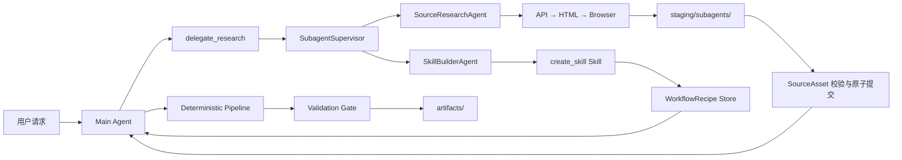

# 托管式 Subagent 研究与 WorkflowRecipe 自学习设计

> 状态：已批准
> 日期：2026-07-28
> 对应任务：TASK-030
> 影响范围：Agent Loop、Runtime、Skill Gateway、Crawler、SourceAsset、前端任务投影

## 1. 背景

当前 BioMed-QAgent 的 Main Agent 只能在用户勾选的数据源和既有 Skill
范围内工作。虽然系统已经具备 durable Task/Run、事件回放、Skill Catalog、
三级网络采集回退和确定性 Pipeline，但缺少单个 Run 内的父子 Agent 编排。

这会产生三个直接问题：

1. Main Agent 发现新的可用数据源后，无法并行委派专门 Agent 调研和采集。
2. 用户勾选的数据源在 `SkillGateway` 中被当作硬 allowlist，阻止 Agent
   探索未勾选但公开可用的来源。
3. 现有 `self_evolution` 允许模型生成 Python 并写入 `learned/`，不适合承载
   从未知网页学习到的流程：网页提示词注入可能被直接固化为可执行代码。

本设计在现有 Agent + Deterministic Pipeline 双层架构中增加一个托管式
`SubagentSupervisor`。子 Agent 负责探索和采集，Pipeline 继续负责确定性处理、
产物构建和 Validation Gate；两者职责不混合。

## 2. 目标

- Main Agent 可以在一个父 Run 内批量委派多个子 Agent，并继续执行其他工作。
- 子 Agent 可以探索用户未勾选的公开、免登录数据源。
- 采集遵守 API → HTML → Browser 的三级回退。
- 成功跑通的新流程自动沉淀为不可执行、可审计、可检索和可重放的
  `WorkflowRecipe`。
- Main Agent 在能力缺口导致卡住时，能够明确调用内部 `create_skill` Skill。
- 子 Agent 状态通过父 Task 的 durable event log 实时展示和回放。
- 所有正式产物仍然只能由 Pipeline 的 Validation Gate 发布。
- 沿用现有 Base Nova、shadcn/ui、Phosphor Icons 和页面布局。

## 3. 非目标

- 不把子 Agent 建模为独立 Task，也不在 MVP 中提供跨 Task 的子 Agent 恢复。
- 不允许递归委派；子 Agent 不能再创建子 Agent。
- 不自动把新流程提升为可执行 Python Skill。
- 不让子 Agent 直接写入正式 `artifacts/`。
- 不在本次重构中替换 TaskManager、TaskRepository、EventStore 或 Pipeline。
- 不实现多用户共享 Recipe 市场、云端 Recipe 同步或分布式任务队列。

## 4. 总体架构



`SubagentSupervisor` 由 FastAPI lifespan 创建，和 `TaskManager` 一样是长期运行时
服务；具体子 Agent 始终归属于发起它的父 Run。Supervisor 管理并发、取消、
HIL 请求路由、事件发射和清理，不承担研究决策。

## 5. 核心运行时模型

### 5.1 子 Agent 类型

系统只提供两种一级子 Agent：

- `SourceResearchAgent`：已存在可用 Skill 或已验证 Recipe 时，执行数据源检索、
  下载和 SourceAsset 生成。
- `SkillBuilderAgent`：确认存在能力缺口时，调用 `create_skill` 开发、验证并保存
  WorkflowRecipe；验证通过后可在同一 Run 中重放一次。

Main Agent 通过一个批量委派工具提交最多 8 个 `SubagentRequest`。Supervisor
返回轻量句柄，Main Agent 不必等待所有子任务完成，可以继续推理或调用其他工具。
需要结果时，Main Agent 查询批次状态或等待指定子任务。

### 5.2 SubagentRecord

`TaskSnapshot` 增加向后兼容的 `subagents: list[SubagentRecord] = []`。记录至少包含：

- `subagent_id`、`task_id`、`run_id`
- `agent_type`
- `objective` 和目标来源
- `status`
- `parent_tool_call_id`
- `created_at`、`started_at`、`finished_at`
- `progress_current`、`progress_total`、`progress_message`
- `result_summary`
- `source_asset_ids`、`recipe_id`
- `error_code`、`error_message`
- `pending_request_id`

状态机为：

```text
queued → running → completed
                 ↘ failed
queued/running → cancel_requested → cancelled
queued/running → interrupted
```

HIL 不把整个父 Run 改为 `AWAITING_USER_INPUT`。子 Agent 保持 `running`，同时用
`pending_request_id` 表示局部等待；其他兄弟子 Agent 和 Main Agent 可以继续运行。

### 5.3 SubagentResult

子 Agent 只向 Main Agent 返回结构化轻量结果：

- `subagent_id`
- `status`
- `summary`
- `source_asset_ids`
- `recipe_id`
- `warnings`
- `error`

大文件、网页内容和下载数据只能通过 SourceAsset ID 或 Recipe ID 引用，禁止把完整
HTML、二进制内容或大段表格塞进模型上下文。

## 6. 事件与持久化契约

### 6.1 事件顺序

所有子 Agent 事件写入父 Task 的同一 `events.jsonl`，继续使用 Task-local
单调递增 `sequence`。这保证 WebSocket 实时流、HTTP replay 和 TaskSnapshot
reducer 看到完全相同的顺序。

`EventEnvelope` 在 schema version `2.0` 中增加两个可选字段：

- `subagent_id`
- `parent_tool_call_id`

旧事件缺少这两个字段时继续合法。现有 `tool_started`、`tool_completed`、`warning`
和 `stage_progress` 可以携带 `subagent_id`，但子 Agent 自身生命周期使用专用事件：

- `subagent_queued`
- `subagent_started`
- `subagent_progress`
- `subagent_completed`
- `subagent_failed`
- `subagent_cancel_requested`
- `subagent_cancelled`
- `subagent_interrupted`
- `subagent_input_required`
- `subagent_input_resumed`

子 Agent 的模型 token 流和隐藏推理不写入主聊天。主聊天只显示委派工具的简短状态和
最终摘要；详细操作步骤在右侧 subagent 工作区展示。

### 6.2 重启语义

MVP 不恢复正在进行的网络或浏览器动作。进程启动恢复时：

- 父 Run 按现有规则标记为 `interrupted`。
- 其 `queued`、`running`、`cancel_requested` 子 Agent 全部补写
  `subagent_interrupted`。
- 已完成 SourceAsset 和 Recipe 保留。
- 用户重新发起 Run 后可以复用已验证 Recipe，但不会隐式续跑旧子 Agent。

## 7. 委派、并发与取消

### 7.1 并发限制

- 单次批量委派最多 8 个子任务。
- 每个父 Run 最多同时运行 3 个子 Agent。
- 整个进程最多同时运行 4 个子 Agent。
- 每个子 Agent 默认最多 10 个模型 turns。
- 每个子 Agent 默认总时限 15 分钟。
- 子 Agent 不占用 TaskManager 的父 Run 并发槽，但必须经过 Supervisor 全局信号量。

Supervisor 使用结构化并发管理同一批次，保证异常、取消和清理可以向子任务传播。
同一父 Run 的子任务可以并发，不同父 Run 共享全局上限。

### 7.2 取消

- 取消父 Run 会向其全部非终态子 Agent 传播取消。
- 前端允许取消单个子 Agent。
- 新增
  `POST /api/v1/tasks/{task_id}/runs/{run_id}/subagents/{subagent_id}/cancel`。
- 单个子 Agent 失败或取消不自动终止父 Run。
- 如果全部子 Agent 失败且没有 SourceAsset，Main Agent 不得调用 Pipeline 或伪造完成。

## 8. 数据源访问与三级回退

### 8.1 数据源选择语义

用户勾选的数据源从硬 allowlist 改为 `preferred_sources`：

- Main Agent 优先搜索这些来源。
- 公开、免登录、无需私密凭据的其他来源可以自动访问。
- 需要登录、CAPTCHA、API key、付费订阅、上传凭据或确认服务条款时必须发起 HIL。
- 禁止从网页文本中提取、推断或复用凭据。

Skill Gateway 仍执行来源能力和安全策略，但不能仅因来源未被勾选而拒绝公开访问。

### 8.2 三级回退

每个来源的采集严格按以下顺序执行：

1. 官方 API：优先使用已有 acquisition/discovery Skill；没有 Skill 时允许 Recipe
   描述公开 API 请求。
2. HTML 解析：使用异步 HTTP 客户端，解析公开静态页面。
3. Browser：前两级被明确判定为不可用后，通过 Playwright BrowserPool 操作页面。

失败必须记录尝试层级、URL、时间、状态码或异常类别，以及转入下一层的理由。不得在
官方 API 可用时无理由直接启动浏览器。

### 8.3 BrowserPool

Crawler 从“每次调用启动一个 Chromium”改为 lifespan-owned BrowserPool：

- 一个 Chromium 进程。
- 最多 4 个并发 BrowserContext。
- 每个子 Agent 使用隔离 Context。
- 同一 host 使用独立限速器，不能由一个站点的等待串行化所有站点。
- 父 Run/子 Agent 取消时关闭对应页面和 Context。
- 浏览器下载仍必须进入子 Agent staging 目录。

## 9. SourceAsset 隔离与发布

每个子 Agent 只能写入：

```text
<task-runtime>/staging/subagents/<subagent_id>/
```

采集完成后执行 SourceAsset 校验，包括：

- 文件位于当前 staging 根目录内，拒绝路径穿越。
- URL scheme、host 和重定向链通过现有网络安全策略。
- 文件存在且大小、摘要、MIME/格式元数据有效。
- SourceAsset 的来源、获取方法、时间和尝试日志完整。

校验通过后，以原子重命名或等价的同文件系统提交方式加入父 Run 的 SourceAsset
集合。子 Agent 无权写 `artifacts/`。只有 Main Agent 调用确定性 Pipeline 后，
Validation Gate 才能发布正式产物。

## 10. WorkflowRecipe 与 create_skill

### 10.1 Recipe 定位

WorkflowRecipe 是数据而不是代码。它描述一个已尝试的采集流程，可检索、可审计、
可重放，但不能执行任意 Python、Shell 或 JavaScript。

Recipe 生命周期：

```text
draft → verified → promoted
              ↘ rejected
```

- `draft`：流程已生成但尚未成功重放。
- `verified`：在受控执行器中成功获取并验证至少一个 SourceAsset。
- `promoted`：用户批准后转换为项目可执行 Skill。
- `rejected`：验证或审批明确拒绝；保留审计记录但不参与匹配。

### 10.2 Recipe 内容

每个 Recipe 由结构化 `recipe.json` 和生成的 `WORKFLOW.md` 组成，包含：

- `recipe_id`、`version`、`digest`、`status`
- 创建和验证时间、生成模型、目标 domain/capability
- 适用 URL/host 和输入参数 schema
- API、HTML、Browser 步骤的声明式操作
- 每次尝试、失败原因、回退理由和最终成功路径
- 输出提取规则和 SourceAsset 映射
- 安全要求、HIL 要求、限速和超时
- 验证证据和最后一次成功时间

Recipe 不保存 cookie、token、API key、Authorization header、表单密码或原始用户凭据。
日志和文档写盘前统一执行 secret redaction。

### 10.3 create_skill 是内部 Skill

`create_skill` 作为不可由用户直接选择的 builtin processing Skill，仍通过
`find_skill` / `invoke_skill` 调用。它只暴露四个操作：

- `develop_workflow`
- `validate_recipe`
- `find_recipe`
- `request_promotion`

它不能直接写 `backend/app/skills/learned/`，也不能接受模型生成的任意代码。
`request_promotion` 只创建待审批请求；用户批准后才进入独立的 Skill 生成、代码审查
和测试流程。

### 10.4 触发规则

Main Agent 提示词必须明确：

- 已知 Skill/verified Recipe 存在时使用 `SourceResearchAgent`。
- 明确的 `capability_gap` 才创建 `SkillBuilderAgent` 并调用 `create_skill`。
- 普通 `not_found` 表示查询无结果，不是能力缺口，不能触发 `create_skill`。
- `auth_required`、`captcha_required`、`payment_required` 和
  `credential_required` 必须转 HIL。
- 同一个父 Run 内，同一 `domain + capability` 最多调用一次 `create_skill`。
- 新来源成功后仍需把 SourceAsset 交给 Pipeline；不能直接组织最终 CSV。

`extraction_failed` 只有在保留了 API/HTML/Browser 三级尝试证据时，才能升级为
能力缺口。

## 11. HIL 与安全边界

子 Agent 使用按 `request_id` 路由的独立 HIL broker。`subagent_input_required`
事件包含 `subagent_id`、提示类型、摘要、过期时间和经过截断的结构化 detail。
前端仍通过父 Run 的 resume API 提交决定，并用 `request_id` 精确路由：

```text
POST /api/v1/tasks/{task_id}/runs/{run_id}/resume
```

TaskManager 先尝试子 Agent HIL broker，再回退到现有 Pipeline/Agent resume channel。
不存在或已处理的 `request_id` 返回冲突，不得误唤醒其他等待者。

安全测试和运行时策略必须覆盖：

- SSRF 与私网地址阻断。
- 重定向后的 host 重新校验。
- staging 路径穿越和符号链接逃逸。
- 网页提示词注入不能改变系统工具策略。
- Recipe 和事件 secret redaction。
- BrowserContext 隔离和取消清理。
- 登录、CAPTCHA、付费和凭据边界。

## 12. 错误模型

子 Agent 使用稳定的机器可读错误码：

- `not_found`
- `capability_gap`
- `extraction_failed`
- `auth_required`
- `captcha_required`
- `credential_required`
- `payment_required`
- `policy_denied`
- `rate_limited`
- `timed_out`
- `cancelled`
- `internal_error`

单个失败只记录在对应 `SubagentRecord` 和事件中。Main Agent根据成功结果继续工作，
并向用户说明缺失来源。若所有委派均失败，则结束当前研究分支并给出可操作原因；
不得调用空 Pipeline 或产生虚假 artifact。

## 13. 前端设计

### 13.1 桌面端

沿用当前三栏结构：

- 左栏：现有 SessionSidebar，不改变。
- 中栏：现有 ChatPanel 和消息流，不改变视觉语言。
- 右栏：把 `ArtifactWorkspace` 替换为 `SubagentWorkspace`，继续使用现有
  `ResizablePanel`。

第一个子 Agent 进入 `queued` 时自动打开右栏，用户可以折叠。右栏按子 Agent 显示：

- 类型、目标来源、状态 Badge。
- 当前步骤、Progress、运行时间。
- API/HTML/Browser 回退时间线。
- warning、HIL 和错误摘要。
- 取消单个子 Agent 的操作。
- 完成后的 SourceAsset/Recipe 引用。

使用现有 shadcn 组件：Accordion、Badge、Progress、ScrollArea、Button、Spinner、
Empty；使用 Phosphor 图标和语义化主题 token，不引入第二套设计系统。

### 13.2 移动端

不保留常驻右栏。ChatPanel 顶部提供 subagent 状态按钮，点击后使用现有 `Sheet`
展示同一内容，并提供可访问的 `SheetTitle`。

### 13.3 产物 FAB

移除当前常驻产物右栏。聊天输入区左下角增加产物 FAB：

- 无产物时隐藏或禁用。
- 有产物时显示数量。
- 点击后打开 bottom Sheet。
- 复用现有 Attachment、Tabs 和 ResultsViewer。
- 提供预览、下载单个产物和“保存全部产物”。

前端 `TaskProjection` 增加 `subagentsById` 和 `subagentOrder`，由 reducer 从 durable
事件和 snapshot 重建。旧任务默认空集合，现有消息投影不受影响。

## 14. 实施与主分支同步策略

项目仍处于快速开发阶段，没有生产服务依赖当前行为，因此不设置功能开关、不保留
新旧执行路径双轨运行，也不为旧 `self_evolution` 提供兼容入口。实现完成后，
Main Agent 直接注册新的委派工具，Skill Gateway 直接采用 preferred sources
语义，前端右侧工作区直接切换为 subagent 视图。

实施顺序只用于建立可测试的依赖关系，不代表灰度发布：

1. 增加事件、snapshot、reducer 和 Supervisor 契约，以 fake child runner
   验证事件、并发、取消、HIL 和重启。
2. 接入真实 SourceResearchAgent、SkillBuilderAgent、Main Agent 委派工具、
   Recipe Store、受控执行器和 `create_skill`。
3. 在同一阶段封闭旧 `self_evolution` 的任意 Python 写入路径，不保留回退开关。
4. 改造异步 Crawler、per-host limiter 和 BrowserPool。
5. 前端右侧直接替换为 subagent 工作区，产物入口直接迁移到 FAB。
6. 完成跨层端到端验证。

仅保留数据兼容：历史 `events.jsonl`、TaskSnapshot 和前端回放必须继续工作，
但不会保留旧工具注册、旧提示词或旧自进化执行路径。

为避免长期分支积累大规模冲突，每完成一个独立可评审任务并形成干净提交后，都要
获取最新 `origin/main` 并把它 rebase 到当前功能分支；如有冲突立即解决并重跑受影响
测试，不把冲突推迟到整个功能结束时统一处理。

## 15. 测试策略

### 15.1 后端单元与契约测试

- 所有新事件 payload、Envelope linkage 和旧事件兼容。
- reducer 对每个子 Agent 状态转换、非法转换和重复事件的处理。
- per-Run 3、global 4、batch 8 并发限制。
- 父 Run 取消、单子 Agent 取消、超时和进程恢复中断。
- 独立 HIL request 路由，兄弟子 Agent 不被暂停。
- SourceAsset staging、摘要校验、原子提交和路径逃逸拒绝。
- Recipe 状态转换、digest/version、匹配、重放和 secret redaction。
- `capability_gap` 触发 create_skill，`not_found` 不触发。
- preferred sources 优先但不阻止公开来源。

### 15.2 Crawler 与安全测试

- API 成功时不进入 HTML/Browser。
- API 不可用后进入 HTML，HTML 不可用后才进入 Browser。
- 每次回退有结构化证据。
- BrowserPool 只启动一个 Chromium，最多 4 个 Context。
- 不同 host 不互相串行，同 host 遵守限速。
- SSRF、重定向、认证、CAPTCHA、付费、凭据和 prompt injection 防护。

### 15.3 前端测试

- 新事件和 snapshot 的 reducer 投影。
- 桌面右栏自动打开、折叠、详情和取消。
- 移动 Sheet 的内容与可访问性。
- 产物 FAB 数量、bottom Sheet、预览和保存全部。
- 缺少 `subagent_id` 的旧事件回放。
- reconnect 后不重复或丢失子 Agent 状态。

### 15.4 集成与质量门禁

- 固定公开测试站点的 API → HTML → Browser 集成用例。
- 多子 Agent 并发采集后把 SourceAsset 交给 Pipeline。
- Validation Gate 仍是唯一 artifact 发布者。
- 重启、取消、事件 replay 和 HIL 端到端用例。
- 后端：全量 pytest、Ruff、冷启动 Uvicorn。
- 前端：lint、tsc、Vitest、production build。

## 16. 验收标准

以下条件全部满足时，TASK-030 才能视为完成：

1. Main Agent 能同时委派多个来源且继续执行其他工作。
2. 未勾选的公开来源可以被自动探索；受保护来源稳定进入 HIL。
3. 三级回退顺序和每次尝试可从 durable events/Recipe 审计。
4. 新流程自动保存为不可执行 Recipe，并能验证后重放。
5. Main Agent 在真实能力缺口时调用 create_skill，普通无结果不会调用。
6. 父子取消、超时、重启和事件回放满足本设计契约。
7. 子 Agent 不能绕过 SourceAsset 校验或 Validation Gate 发布产物。
8. 桌面和移动前端沿用现有 UI，并能实时显示子 Agent。
9. 旧任务和旧事件回放无回归，旧工具和旧自进化路径已被替换。
10. 全部项目质量门禁通过。

最后你需要直接通过浏览器（内置或调用我的chrome）完整运行一次测试，确保一切无误

## 17. 实施计划拆分

本文件是跨层架构规范，实施时拆成三个顺序执行、可独立评审的计划：

1. **Runtime Foundation**：事件契约、SubagentRecord、Supervisor、并发、取消、
   HIL broker、恢复语义，以及基于 fake child runner 的完整后端测试。
2. **Research and Learning**：真实子 Agent、Main Agent 委派提示词、preferred
   sources、SourceAsset staging、WorkflowRecipe、create_skill、Crawler 和
   BrowserPool。
3. **Frontend and Integration**：前端 durable projection、右侧 subagent 工作区、
   移动 Sheet、产物 FAB，以及端到端与迁移验证。

第二个计划依赖第一个计划的稳定接口，第三个计划依赖第一个计划的事件和 snapshot
契约。三个计划全部完成前，TASK-030 不得标记完成。
